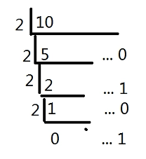
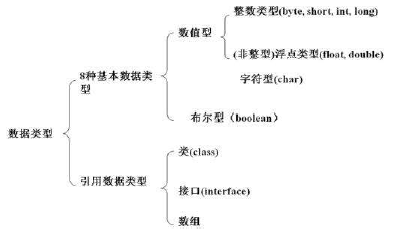

# 第02章 第03节 基础语法

## 1. 二进制

计算机中的存储单位：

- 位(Bit): 表示一个二进制数码0或1，是计算机存储处理信息的最基本单位；
- 字节(Byte): 一个字节由8个位组成，它表示作为一个完整处理单元的8个二进制数码（最小为0，最大为 1111<sub>2</sub> 即 255<sub>10</sub>）。

十进制换算二进制简化算法可用十进制数重复除以2，直到无法再除，其余数倒序即为二进制数，例如10<sub>10</sub>转换为1010<sub>2</sub>：



[百度知道：十进制与二进制小数转换](https://jingyan.baidu.com/article/425e69e6e93ca9be15fc1626.html)

## 2. 变量

变量就是系统为程序分配的一块内存单元，用来存储各种类型的数据。数据可以改变，故为“变量”。

## 2.1 变量分类：

按照所属数据类型划分：

- 基本数据类型变量：8种基本数据类型
- 引用数据类型：类(如String等)、接口、数组

按照声明位置划分：

- 局部变量：方法或语句块内部定义的变量
- 成员变量：方法外部、类的内部定义的变量

注意：**<font color="red">类的外面不能有变量的声明！</font>**

## 3. 数据类型



## 3.1 基本数据类型 (8种)

- 整数型 int: 4 Byte [-2<sup>31</sup> ~ 2<sup>31</sup>-1] (首比特位用于显示正负号，故2的指数永远少一位，4 个字节有4×8=32个比特位，故最小值为-2<sup>32-1</sup>，且最大值为2<sup>32-1</sup>-1，以下整型类的基本类型皆如此)
- 短整数型 short: 2 Byte [-2<sup>15</sup> ~ 2<sup>15</sup>-1]  
- 长整数型 long: 8 Byte [-2<sup>63</sup> ~ 2<sup>63</sup>-1]
- 字节型 byte: 1 Byte [-2<sup>7</sup> ~ 2<sup>7</sup>-1 (**<font color="red">-128 ~ 127)</font>**]  **<font color="red">数值较小，面试考点</font>**
- 浮点型 float: 4 Byte
- 双精度型 double: 8 Byte
- 布尔型 boolean: 1 Byte [true / false]
- 字符型 char: 2 Byte [\u0000 ~ \uffff]

需要注意的基本类型：

1. double与float类型变量定义：

   ```java
   float f1 = 10;
   // 无错误提示，因为直接输入的10默认为整型int，与float占用内存空间大小一致
   float f2 = 10.1;
   // 会出现错误提示，因为直接输入的10.1默认为double类型，比float占用的内存空间大
   float f2 = 10.1f;
   // 在浮点数字后面加入f,此时直接写出的10.1将被认为是浮点型，不会报错
   ```

2. long类型变量定义：

   ```java
   long l1 = 2200000000;
   // 此时会报错，long类型变量，直接写出的整型数字，默认类型是int，超出int最大值会报错
   long l2 = 2200000000l;
   // 在直接输入的整型数字后面加入l(long的首字母l不是大写的I)，此时表示的是直接写出的右侧是long类型
   ```

3. char类型

   ```java
   char c1 = 'A';
   // 定义直接赋值时需要使用单引号而非双引号
   // char类型与数字类型可以强制转换，如
   System.out.println((int)c1);
   // 上面的代码将会在console中输出数字65，而
   System.out.println(++c1);
   // 上述代码将会在console中输出字母B，如果进一步进行自加运算
   System.out.println(++c1);
   System.out.println(++c1);
   System.out.println(++c1);
   // 则将会输出C、D、E
   // 以此类推
   // 即char类型可以进行运算
   // 如果输入的并非A而是汉字，则会出现大量的同偏旁字
   ```

## 3.2 引用数据类型：

- 类 class: 如 String 字符串
- 接口 interface
- 数组

## 4. 标识符

Java对包、类、方法、参数和变量等要素命名时使用的字符序列称为标识符。规则如下：

- 由字母、数字、下划线 ( _ ) 和美元符号 ( $ ) 组成 （**<font color="red">不建议用中文</font>**）
- 不能以数字开头
- 区分大小写
- 长度无限制
- 不能是Java种的保留关键字

标识符命名习惯：**<font color="red">见名知意</font>** (阿里巴巴Java编程规范)

## 5. 类型转换

注意：**<font color="red">boolean类型不能转换成任何其它数据类型</font>**

### 5.1 自动类型转换：

容量小的类型自动转换为容量大的类型：

byte, short, int -> float -> long -> double

byte, int, short 不会相互转换，它们在计算时会转换成int类型

### 5.2 强制类型转换

容量大的类型转换成容量小的数据类型时，要加上强制转换符

```java
long l = 100L;

int i = (int)l
```

有可能造成**<font color="red">精度降低或数据溢出，使用时小心</font>**。

## 6. 方法

概述：方法用于封装一段特定的逻辑功能。主要要素为：权限修饰符、参数列表和返回值

格式：

```java
权限修饰符 返回值声明 方法名称 (参数列表) {
	方法中封装的逻辑功能;
	return 返回值;
}
```

### 6.1 权限修饰符

private (1) - default (1,2) - protected (1,2,3) - public (all)

同类 1 - 同包 2 - 不同包子类  3- 不同包非子类 4

### 6.2 返回值

若有返回值，则必须return，否则返回值必须为void

### 6.3 参数列表

方法的参数列表：在调用时传递给方法，需要被方法处理的数据。

在方法定义时，需要声明该方法所需要的参数变量。

在方法调用时，会将实际参数值传递给方法的参数变量。必须保证传递参数的类型和个数符合方法的声明。

参数列表可为空。

若有多个参数，则必须用逗号隔开，如：

```java
pubic void print(int a, int b) {
    System.out.println(a);
    System.out.println(b);
}
```

命名规范：如果变量或者方法命名时使用了多个单词，则首单词首字母小写，其余单词首字母大写，用以区分单词，中间不留空格！

# 7. 运算符

## 7.1 算数运算符

- \+ (加) 
- \- (减)  
- \* (乘)
- / (除)
- % (取模)
- \++ (自增) (i++ / ++i 相当于 i = i + 1)
- \-- (自减) (i-- / --i 相当于 i = i - 1)

### 注意：

1. [Java运算规则] 整型与整型的运算结果一定只能是整型，例如除法，若不能整除，则结果的小数部分将被丢弃(或称“截断”)，注意不是四舍五入、不是向上取整、不是向下取整，而是直接舍弃小数部分。

2. “取模”不完全等同于“求余”，在运算符左右的数值的符号(\+/\-)相同时，两种运算的结果相同，否则不同，见：[取模和求余的区别](https://www.cnblogs.com/aliwa/p/6390296.html)。

3. 自增和自减运算符在变量左右位置的不同的含义为：

   在左边(以变量i为例: \++i / \--i)，则先进行自加或自减运算，后进行运算符所在语句的其它运算或者执行所在语句的其它程序功能；

   在右边(以变量i为例: i\++ / i\--)，则先进行运算符所在语句的其它运算或者执行所在语句的其它程序功能，后进行自加或自减运算；

   基于此，位置不同所导致的结果可能不同：

   如果自增或自减运算处于单独的一行语句(功能执行语句，以英文分号结束)且该语句中无其它的运算符，或处于不与其它程序逻辑发生直接作用的相对独立位置(如for语句的最后)，则其在变量左右的位置不改变其结果：

   ```java
   int i = 10;
   i++;
   // ++i
   System.out.println(i);
   // 以上两句输出结果相同，均为11
   
   for (int j = 0; j < 10; j++) {
       System.out.println(j);
   }
   for (int j = 0; j < 10; ++j) {
       System.out.println(j);
   }
   // 以上两个代码块输出结果相同，均为0~9
   ```

   如果自增或自减运算所处语句中有其它的运算或存在其它的程序逻辑或功能，则其输出的值可能不同，如：

   ```java
   int i = 10;
   System.out.println(++i);
   // 输出将会为11
   System.out.println(i);
   // 此时输出为11
   // 即：自增符号在前，则先对i进行自加，后在Console输出i的值；
   
   int j = 10;
   System.out.println(j++);
   // 输出将会为10
   System.out.println(j);
   // 此时输出为11
   // 即：自增符号在后，则先在Console输出j的值，后对j进行自加。
   ```

   自减符号与自加符号使用方式和生效方式相同，类比即可。

## 7.2 赋值运算符

- =
- += ( a+=b 相当于 a = a + b，以下类似)
- -=
- *=
- /=
- %=

## 7.3 关系运算符

- == (相等于)
- != (不等于)
- \> (大于)
- \< (小于)
- \>= (大于等于)
- \<= (小于等于)

注意：关系运算符的运算结果（表达式的值）总是boolean型，即真(true)或假(false)。

## 7.4 逻辑运算符

对boolean型结果的表达式进行运算，其运算结果总是boolean型，即真(true)或假(false)。

- & (与) (全真才真)
- | (或) (全假才假)
- ^ (异或) (相同则假) [使用比较少]
- ! (非) 
- && (短路与)
- || (短路或)

```java
int a = 10;
int b = 20;
int c = 30;
int d = 40;
System.out.println(a>b & c<d);
// 输出为false
```

### 注意：

1. 在计算机中默认1为真，实际只要是非0即真，0为假；
2. “短路与”和“短路或”的作用方式为：“短路与”运算符左侧表达式只要为假，则结果直接输出整个表达式的结果为假，右侧表达式不进行任何运算；“短路或”运算符左侧表达式只要为真，则直接输出整个表达式的结果为真，右侧表达式不进行任何运算。使用短路与和短路或在一般情况下可以节省运算资源，但如果右侧表达式的运算结果将参与程序后面功能的实现，则不能用短路与和短路或。

# 8. 字符串连接符 “\+”

用于拼接字符串(String)。

注意：\+ 两边的任意一边有字符串类型(String)，则\+被视为是字符串连接符，非String类型的内容将被强制转换为String，并对左右两边进行拼接。

# 9. 三目运算符

## 结构

```java
// [boolean结果表达式]?[表达式1]:[表达式2]
// boolean结果表达式的结果为true，则整个三目运算符表达式结果为表达式1的结果，否则为表达式2的结果
int a = 10;
int b = 20;
System.out.println(a<b?"a小于b":"a大于b");
// 输出结果为“a小于b”
```

# 10. 位运算（仅用于int与char）

- \<\< (左移) [左侧十进制数化为二进制数，全体二进制位左移右侧数值量的位数，通常用来进行快速的2<sup>n</sup>的乘法(注意数值溢出)，结果为正数则高位补0，反之补1]
- \>\> (右移) [左侧十进制数化为二进制数，全体二进制位右移右侧数值量的位数，通常用来进行快速的2<sup>n</sup>的除法(注意数值截断)，结果为正数则高位补0，反之补1]
- \>\>\> (无符号右移) [左侧十进制数化为二进制数，全体二进制位右移右侧数值量的位数，无论左侧二进制数为正数还是负数均在结果最高位补0]
- & (位与) [左右两端的十进制整型化为二进制后，比较两者的每个二进制位上的值，每一位上只有均为1时结果为1，输出二进制结果的十进制转换值]
- | (位或) [左右两端的十进制整型化为二进制后，比较两者的每个二进制位上的值，每一位上只有均为0时结果为0，输出二进制结果的十进制转换值]
- ~ (位非) [一元运算符，右侧十进制数化为二进制后，将每个二进制位上的二进制值更改为相反的二进制值，输出二进制结果的十进制转换值]
- ^ (位异或) [左右两端的十进制整型化为二进制后，比较两者的每个二进制位上的值，每一位的二进制值不同时结果为1，相同时结果为0，输出二进制结果的十进制转换值]

 详细介绍见：

- [Java位运算浅析](https://blog.csdn.net/sinat_35938012/article/details/80723948)
- [Java 位运算(移位、位与、或、异或、非)](https://blog.csdn.net/xiaochunyong/article/details/7748713)

# 11. 转义字符

- \n (换行) 010 [将当前位置移动到下一行开头]
- \r (回车) 013 [将当前位置移动到本行开头]
- \t (制表符) 009 [较常用]
- \v (垂直制表符) 011 [较少用]
- \\\\ (反斜杠字符) 092
- \\' (撇号字符) 039 
- \\" (双引号字符) 034

### 注意：

1. Windows下需要\n\r配合才能实现换行；

2. \t制表符在输出时很有用处，可以使输出按列对齐；其对应键盘上的Tab键，但其意义并不是通常理解的四个空格，而是制表符，即进行类似表格般的列的对齐，如：

   ```java
   System.out.println(1\t2\t3\t4);
   System.out.println(11\t22\t33\t44);
   // 输出为
   // 1  2  3  4
   // 11 22 33 44
   ```
