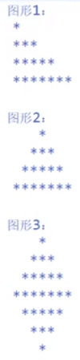

# 程序逻辑结构基础

# 1. 接收用户输入

## 1.1 ```java.util.Scanner```使用解析

```java
import java.util.Scanner

Scanner input = new Scanner(System.in);
// 用于接收各种数据类型
System.out.println("请输入一段数字：");
int i = input.nextInt();
// 必须输入正确的类型，否则
String str1 = input.next();
String str2 = input.nextLine();
// 返回字符串类型
// 注意next()与nextLine()不可同时使用，否则可能导致其中一个无法正常工作
// next()只能接收一行文字，回车和空格都视为结束，即无法接收空格，并且必须读取到有效的字符才能够结束，只输入空格无效，含有空格的内容将省略空格只保留内容
// nextLine() 必须使用回车结束输入
```

## 1.2 判断用户输入类型

交付标准：不能因为输入错误而导致程序崩溃。所以应该在接收用户输入之间判断输入的类型是否合法，例如：

```java
Scanner input = new Scanner(System.in);
System.out.println("请输入一个数字");
// 在接收输入之前判断输入的类型是否为int
if(input.hasNextInt()){
    int num = input.nextInt();
    System.out.println("你输入的是：" + num);
} else {
    System.out.println("你输入的是个锤子");
}

// Scanner类中有多种判断类型的方法，如：
Scanner.hasNextBoolean() : 判断输入的是否为布尔值
Scanner.hasNextInt() : 判断输入的是否为整型
Scanner.hasNextDouble() : 判断输入的是否为双精度浮点值
...
// 等等
```

# 2. 执行结构

- 顺序结构：按照语句出现的顺序执行操作；
- 分支结构 (选择结构)：根据条件成立与否执行操作；
- 循环结构 (重复结构)：如果条件成立，将重复执行某一循环体，直到出现不满足的条件为止

注意：循环结构必须有出口。

# 3. if条件语句

- ```if(condition){...}```
- ```if(condition){...}else{...}```
- ```if(condition){...}else if(condition){...}```
- ```if(condition){...}else if(condition){...}else{...}```

# 4. switch语句

```java
switch(表达式){
    case 取值1: 语句块1;
        break;
    case 取值2: 语句块2;
        break;
    ...
    case 取值n: 语句块n;
        break;
    default: 语句块n+1;
        break;
}
```

### 注意：

- 表达式的返回值必须是以下几种类型之一: 

  int, byte, char, short, String

- case子句中的取值必须是常量，且所有case字句中的取值应是不同的

- default子句是可选的

- break语句用来再执行完一个case分支后使程序跳出switch语句块；如果case后面没有写break则直接往下面执行，即使取值条件不满足！

- case 后面的执行体可写{}也可以不写{}

### 实例：

```java
System.out.println("请输入月份");
Scanner input = new Scanner(System.in);
String text = input.next();
switch (text) {
    case "1":
    case "2":
    case "3":
        System.out.printLn("春季");
        break;
    case "4":
    case "5":
    case "6":
        System.out.printLn("夏季");
        break;
    case "7":
    case "8":
    case "9":
        System.out.printLn("秋季");
        break;
    case "10":
    case "11":
    case "12":
        System.out.printLn("冬季");
        break;
    default:
        System.out.println("你的输入有误");
        break;
}
```

# 5. 循环语句

条件满足的情况下，反复执行特定代码

## 5.1 while循环

符合条件，循环继续执行，否则，循环退出

特点：先判断，再执行

```java
while(condition){
    语句块;
}
```

使用while循环需注意：

1. 分析循环条件和循环操作
2. 套用while语法写出代码
3. 检查循环是否能够退出(更新循环变量，记录循环次数、控制循环何时结束)

实例：

```java
Scanner input = new Scanner(System.in);
System.out.println("请输入班级总人数");
// 使用变量studentNum 记录班级总人数
int studentNum = input.nextInt();
// 变量i用于记录循环的次数，以及控制循环何时结束
int i = 0;
// 定义变量sum, 用于统计总分数
int sum = 0;
while(i<studentNum) {
    i++;
    System.out.println("请输入第"+i+"个学生的成绩: ");
    int s = intput.nextInt();
    sum += s;
}
System.out.println("学生的平均成绩为: " + sum/studentNum);
// 注意此处计算平均成绩的表达式先进行计算，后+执行，但此处+左侧有String，故将被执行为字符串连接符而非加法运算
```

## 5.2 do ... while循环

先执行一遍循环操作，符合条件，循环继续执行；否则循环退出

特点：先执行，再判断

```java
do{
    循环操作;
} while(condition);
```

比较while和do while循环：

- while循环使用频率大于do while
- 有必须需要执行一次循环体，再判断是否需要继续执行的需求的情况下用do while
- while先判断再执行，如果条件满足，再执行循环操作
- do while先执行一遍循环操作，然后再判断条件，如果条件满足，继续执行循环操作

## 5.3 for循环

### 5.3.1 通过while语句引入

循环的要素：

```java
// 定义循环变量
int i = 0;
// 判断循环条件
while(i<10) {
    System.out.println(i);
    // 更新循环变量
    i++;
}
```

随着程序迭代发展，以上使用频繁的特定格式形成了for循环，即for循环脱胎于while循环。

### 5.3.2 for循环的格式

```java
for(/*定义循环变量*/;/*判断循环条件*/;/*更新循环变量*/){循环体;}

for(int i = 0; i < 10; i++) {
    System.out.println(i);
}
```

#### 注意：

1. for格式中的括号中可以留空(保留两个分号)，但此时for循环是死循环，中间的条件判断默认为true。

2. 循环要素与循环体的执行顺序问题:

   ```java
   for(System.out.println("1");;System.out.println("2")){
       System.out.println("3");
   }
   
   ```

   以上代码为死循环，其输出的结果为

   1

   3

   2

   3

   2

   3

   2

   ...

   即先执行打印1，然后判断，此处默认为true，然后执行循环体打印3，然后执行更新循环变量的操作，此处即为打印2，再回到判断，仍为true，执行打印3，打印2 ... 以此循环，打印1的操作仅会执行一次，因创建循环变量并初始化的操作只执行一次。

## 5.4 循环嵌套打印图形

```java
// 打印十行十列星号组成的图形
// 外层循环控制行数
for(int i=0;i<10;i++){
    // 内层循环控制列数
    for(int j=0; j<10; j++){
        System.out.print("* ");
    }
    // 用于换行
    System.out.println();
}
```

尝试打印三角形、梯形、回形、菱形等形状：



- 三角形：行数4，第1行循环1次，第2行循环3次，第3行循环5次，第4行循环7次...

  ```java
  for(int i=0; i<4; i++){
      for(int j=0; j<i*2+1;j++){
          System.out.print("*");
      }
      System.out.println();
  }
  ```

- 正三角形：外层循环4次，内层循环1空格列数(1-3, 2-2, 3-1, 4-0)，内层循环2星号列数(1-1, 2-3, 3-5, 4-7)

  ```java
  for (int i = 0; i < 4; i++) {
      for (int j = 3 - i; j > 0 ; j--) {
          System.out.print(" ");
      }
      // for(int j=i+1; j<4; j++){...}
      for (int j = 0; j < i * 2 + 1; j++) {
          System.out.print("*");
      }
      System.out.println();
  }
  ```

- 棱形(七行)：

  ```java
  for (int i = 0; i < 4; i++) {
  	for (int j = i + 1; j < 4; j++) {
  		System.out.print(" ");
  	}
  	for (int j = 0; j < i * 2 + 1; j++) {
  		System.out.print("*");
  	}
  	System.out.print("\n");
  }
  for (int i = 0; i < 3; i++) {
  	for (int j = 0; j < i + 1; j++) {
  		System.out.print(" ");
  	}
  	for (int j = i + 1; j < 6 - i; j++) {
  		System.out.print("*");
  	}
  	System.out.print("\n");
  }
  ```

- 空心菱形(七行)：

  ```java
  for (int i = 0; i < 4; i++) {
  	for (int j = i + 1; j < 4; j++) {
  		System.out.print(" ");
  	}
  	for (int j = 0; j < i * 2 + 1; j++) {
  		if (j > 0 && j < i * 2) {
  			System.out.print(" ");
  		} else {
  			System.out.print("*");
  		}
  	}
  	System.out.print("\n");
  }
  for (int i = 0; i < 3; i++) {
  	for (int j = 0; j < i + 1; j++) {
  		System.out.print(" ");
  	}
  	for (int j = i + 1; j < 6 - i; j++) {
  		if (j > i + 1 && j < 5 - i) {
  			System.out.print(" ");
  		} else {
  			System.out.print("*");
  		}
  	}
  	System.out.print("\n");
  }
  ```

## 5.5 break与continue

break与continue都可以结束循环，但概念上和使用上不同：

- break用于终止本轮所有次循环，即不执行本次循环中break后面的语句，直接跳出循环；
- continue是用于中止本轮本次循环。即本次循环中continue后面的代码不执行，进行下一次循环的入口判断。

实例：

```java
for(int i=0; i<10; i++){
    if(i==5){
        break;
    }
    System.out.println(i);
}
// 输出：
// 0
// 1
// 2
// 3
// 4
// 即到5则完全跳出循环

for(int i=0; i<10; i++){
    if(i==5){
        continue;
    }
    System.out.println(i);
}
// 输出：
// 0
// 1
// 2
// 3
// 4
// 6
// 7
// 8
// 9
// 即跳过i=5的那次循环
```

## 5.6 退出多重循环

在内层循环中使用break只能跳出break所在的那层循环，如果需要破层跳出循环则需要特殊写法，即对循环进行命名，在循环定义语句前加 “[名称]:”

```java
haha:for(int i=0; i<10; i++){
    for(int j=0; j<10; j++){
        System.out.println("i="+i+" , j="+j);
        if (i==5 && j==5) {
            break haha;
        }
    }
}

// 此时break语句将直接跳出最外层循环，即跳出命名为haha的循环
```