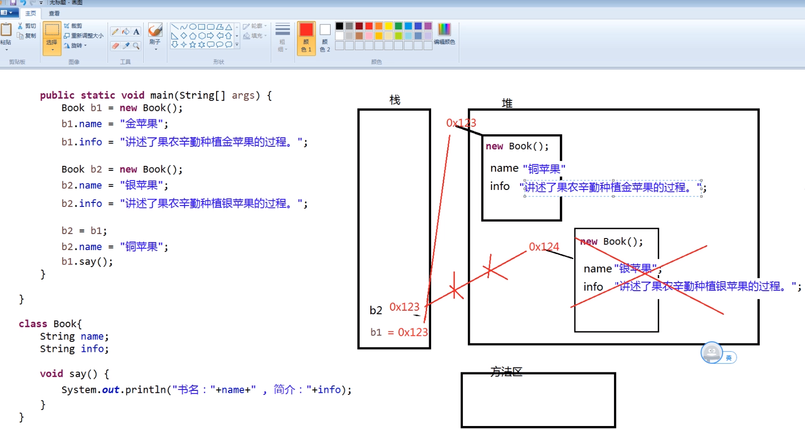

# 1 面向对象基础

## 1.1 面向对象思想

### 1.1.1 概述

面向对象(Object Oriented)是软件开发方法。面向对象的概念和应用已超越了程序设计和软件开发，是一种对现实世界理解和抽象的方法，是计算机编程技术发展到一定阶段后的产物。

面向对象是相对于面向过程来讲的，指的是把 相关的数据和方法组织为一个整体 来看待，从更高的层次来进行系统建模，更贴近事物的自然运行模式。

面向过程到面向对象思想层面的转变：

- 面向过程关注的是执行的过程，面向对象关注的是具备功能的对象。
- 面向过程到面向对象，是程序员思想上 从执行者到指挥者的转变。

### 1.1.2 三大思想

面向对象思想从概念上讲分为以下三种：OOA、OOD、OOP

- OOA：面向对象分析（Object Oriented Analysis）
- OOD：面向对象设计（Object Oriented Design）
- OOP：面向对象程序（Object Oriented Programming）

### 1.1.3 三大特征

- 封装性：所有的内容对外部不可见
- 继承性：将其他的功能继承下来继续发展
- 多态性：方法的重载本身就是一个多态性的体现

## 1.2 类与对象

### 1.2.1 两者关系

类表示一个共性的产物，是一个综合的特征，而对象，是一个个性的产物，是一个个体的特征。（类比生活中的**图纸**与**实物**的概念。）

**类必须通过对象才可以使用**，对象的所有操作都在类中定义。

类由属性和方法组成：

- 属性：就相当于人的一个个的特征
- 方法：就相当于人的一个个的行为，例如：说话、吃饭、唱歌、睡觉

### 1.2.2 类的定义格式

```java
class 类名称{
    成员属性
    成员方法
}
```

### 1.2.3 属性与方法

```java
// 属性定义格式：
数据类型 属性名;
// 属性定义并赋值的格式：
数据类型 属性名 = 初始化值;
// 方法定义格式
权限修饰符 返回值类型 方法名(形式参数列表){
    // 方法体
    return 返回值;
    // 若没有返回值，仅执行方法逻辑，则返回值类型为 void，不需声明return语句
}
// 例外：无返回值时使用return语句
// 用途：设定条件中止方法执行(见1.2.5实例)
```

**形式参数**列表：形参，以英文逗号分隔的参数，给定类型名和参数名，该方法执行时需要外部传入的参数；

### 1.2.4 对象的创建与使用

```java
// 一个类要想真正的进行操作，则必须依靠对象，对象的定义格式如下:
类名称 对象名称 = new 类名称();
// 如果要想访问类中的属性或方法（方法的定义），则可以依靠以下的语法形式：
// 访问类中的属性：
对象.属性;
// 对类的属性进行赋值：
对象.属性 = 值;
// 调用类中的方法：
对象.方法(实际参数列表);
```

**实际参数**列表：实参，以英文逗号分隔的实际数值，是实际传入的参数，必须符合形参的数据类型顺序。

### 1.2.5 实例

类必须编写在.java文件中，一**个.java文件中，可以存在N个类**，但是只能存在一个`public`(公有，所有位置均可访问)修饰的类，作为该.java文件对外的公共类存在，一个.java文件只能有一个主类存在。

.java文件的文件名称，必须与`public`修饰的类名完全一致。

以下代码为Demo.java文件，位于study.demo包内

```java
package study.demo;

// 公有类，只能有一个
public class Demo {
    public static void main(String[] args){
        // 创建对象
        Person p = new Person();
        // 若未进行初始化，对象的默认值未null(空)
        // 对象属性赋值
        p.name = "张三";
        p.age = 18;
        p.sex = '男';
        // 调用类的方法
        p.say();
        System.out.println(p.sum(100, 200));
    }
}

// 其它类，可有多个，此处为Person类
class Person{
    
    // 属性 - 特征
    String name;
    int age;
    char sex;
    
    // 方法 - 行为
    void say(){
        System.out.println("自我介绍：我是" + name + "，我的年龄：" + age + ", 我的性别：" + sex);
    }
    
    int sum(int x, int y){
        return x + y;
    }
    
    // return的特殊使用：满足条件即中止方法
    void xxx(){
        if(ture){
            // 此处return将会中止该方法，return后面的代码均无法执行
            return;
        }
    }
}
```

注意：同一个包中不能有重名的类，无论该类在哪个.java文件中。

## 1.3 创建对象内存分析

- Java程序员需要关注的内存位置为 栈 和 堆（理解和掌握）；
- 实际Java程序运行时程序员无法设定特定元素存储在栈中还是堆中，以及存储的内存位置，但其运行规则需要理解。

### 1.3.1 栈

#### 1.3.1.1 概述

栈(Stack): Java中一个线程一个栈区，每一个栈中的元素都是私有的，不被其它栈所访问。栈有后进先出的特点，栈中的数据大小与生存期都是确定的，缺乏灵活性，但存取速度比堆快，仅次于CPU中的寄存器：

- Java栈的区域很小 , 大概2m左右 , 特点是存取的速度特别快
- 栈存储的特点是, 先进后出

存储速度快的原因:

- 栈内存, 通过 '栈指针' 来创建空间与释放空间
- 指针向下移动, 会创建新的内存, 向上移动, 会释放这些内存
- 这种方式速度特别快 , 仅次于PC寄存器
- 但是这种移动的方式, 必须要明确移动的大小与范围
- 明确大小与范围是为了方便指针的移动 , 这是一个对于数据存储的限制, 存储的数据大小是固定的 , 影响了程序的灵活性
- 所以我们把更大部分的数据存储到了堆内存中（实际上Java程序员无法对数据的存储位置进行设定和操作）

#### 1.3.1.2 存储内容：

1. 基本数据类型的数据
2. 引用数据类型的引用(名称及其对应的堆内存地址）

GC垃圾回收标准：堆中的对象不存在任何栈中的引用，则会被视为垃圾，将会被回收

实例：

```java
int a = 10;
// 数据名称 a 以及它的值 整型10 存储在栈内存中
Person p = new Person();
// 对象的引用 p 存在栈内存中
// 语句 new Person() 将会在堆内存中声明占用一个内存空间，该空间的内存地址（十六进制, 如0x1234）将存储在栈内存 p 的内存位置中，调用该对象时据此在堆内存中寻址并进行相应操作
```

### 1.3.2 堆

- 存放的是类的对象

- Java是一个纯面向对象语言, 限制了对象的创建方式: 所有类的对象都是通过new关键字创建：

  new关键字, 是指告诉JVM , 需要明确的去创建一个新的对象 , 去开辟一块新的堆内存空间

- 堆内存与栈内存不同, 优点在于我们创建对象时 , 不必关注堆内存中需要开辟多少存储空间 , 也不需要关注内存占用时长 

- 堆内存中内存的释放是由GC(垃圾回收器)完成的：

  垃圾回收器GC 回收堆内存的规则: 当栈内存中不存在此对象的引用时,则视其为垃圾 , 等待垃圾回收器回收（见1.3.1.2）

（见1.3.1.2中的实例）

### 1.3.3 方法区

存放的是

- 类信息
- 静态的变量
- 常量
- 成员方法

方法区中包含了一个特殊的区域 ( 常量池 )(存储的是使用static修饰的成员)

### 1.3.4 PC寄存器

PC寄存器保存的是 当前正在执行的 JVM指令的 地址

在Java程序中, 每个线程启动时, 都会创建一个PC寄存器

### 1.3.5 本地方法栈

保存本地(native)方法的地址

### 案例分析：

视频讲解：画图分析 栈、堆、方法区 内存使用的动态过程

- **10_对象创建内存02.mp4** [5:40]
- **11_对象创建内存03.mp4** [6:38]



## 1.4 构造方法(构造器)

对象创建 new Person() 最右侧的小括号，实际就是在调用构造方法。

### 1.4.1 概述

- 作用：用于对象初始化

- 执行时机：在创建对象时,自动调用

- 特点：

  所有的Java类中都会至少存在一个构造方法

  如果一个类中没有明确的编写构造方法, 则编译器会自动生成一个无参的构造方法, 构造方法中没有任何的代码

- 注意：

  如果自行编写了任意一个构造器, 则编译器不会再自动生成无参的构造方法。

### 1.4.2 定义格式

与普通方法基本相同, 区别在于: 方法名称必须与类名相同, 没有返回值类型的声明

```java
public class Demo3{
    public static void main(String[] args){
        Person P = new Person();
        // 其它操作
    }
    class Person{
        // 无参构造方法
        public Person(){
            System.out.println("对象创建时，此方法调用");
        }
    }
}
// 运行时将会在创建p对象时在控制台输出“对象创建时，此方法调用”
```

### 1.4.3 构造方法设计

- 建议自定义无参构造方法，不要对编译器产生依赖，避免错误发生；
- 当类中有非常量成员变量时，建议提供两个版本的构造方法，一个是无参构造方法，一个是全属性做参数的构造方法；
- 当类中所有成员变量都是常量或者没有成员变量时，建议不提供任何版本的构造方法

## 1.5 方法的重载：

一个类中定义的方法允许重载(即方法名称相同)

1. 方法名相同
2. **参数列表长度** 或 **参数类型** 或 **参数类型顺序**不同

**注意：方法的重载与返回值无关**，如

```java
int sum(int x, int y) {
    int z = x + y;
    return z;
}

double sum(int x, int y) {
    int z = x + y;
    return z;
}

// 实际上在编程中上述两个方法将在IDE中提示错误信息，表示两个sum重复了，注意不是重载，即两者的方法名和参数列表完全相同了，此时并不构成方法的重载
```

**参数类型顺序不同的方法重载**：

```java
double sum(int x, double y){
    double z = x + y;
    return z;
}

double sum(double x, int y){
    double z = x + y;
    return z;
}

// 以上两个方法构成了sum方法的重载
```

方法的重载 ,可以让我们在不同的需求下, 通过传递不同的参数调用方法来完成具体的功能。

## 1.6 构造方法的重载

- 一个类, 可以存在多个构造方法
- 参数列表的长度或类型不同即可完成构造方法的重载

构造方法的重载 ,可以让我们在不同的创建对象的需求下, 调用不同的方法来完成对象的初始化

## 1.7 匿名对象

不进行命名(没有对象名称)的对象，只能使用一次

```java
int num = new Math().sum(100, 200);
// new Math()即为匿名对象，没有对此Math类的对象进行命名而是直接使用

class Math{
    int sum(int x, int y){
        return x + y;
    }
}
```

- 匿名对象只能使用一次，因为没有任何的对象引用，所以将称为垃圾，等待被GC回收
- 只使用一次的对象可以通过匿名对象的方式完成，这一点在以后的开发中将经常使用到

