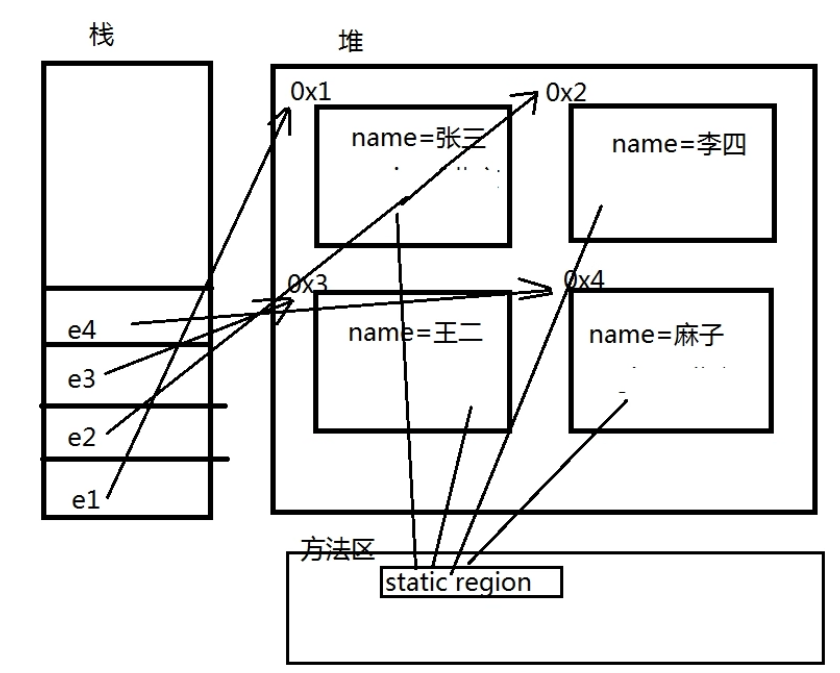

## 2. 面向对象进阶

## 2.1 封装(private关键字)

将类的属性以```private```权限修饰符修饰，使其不能直接从外部访问，并依据需求提供```public```权限的setter及getter方法以从外部对类的属性进行设置及访问，这种程序的设计方式称为封装。

### 2.1.1 概述

封装的意义在于保护或者防止代码（数据）被无意中破坏；避免出现诸如人的年龄出现负值这种逻辑错误。
保护成员属性，不让类以外的程序直接访问和修改。

### 2.1.2 封装原则：

隐藏对象的属性和实现细节，仅对外公开访问方法，并且控制访问级别。

### 2.1.3 实例

```java
public class Demo{
    public static void main(String[] args[]){
        // 创建Person类的对象p
        Person p = new Person();
        // 使用Person类提供的setter方法设置属性
        p.setName("张三");
        p.setAge(-30);
        p.tell();
        // 此时编译器将会输出
        // "姓名：张三；年龄：0"
        // 因在年龄的setter方法中加入了if判断，如果年龄输入为负值，则age将不被赋值，即输出其默认值0
    }
}
// Person类
class Person{
    // 对姓名和年龄两个属性进行封装
    private String name;
    private int age;
    // 成员方法，输出信息
    void tell(){
        System.out.println("姓名：" + getName() + "；年龄：" + getAge());
    }
    // setter和getter方法
    public void setName(String str){
        name = str;
    }
    public void setAge(int a){
        if(a>0 && a<150) {
            age = a;
        }
    }
    public String getName(){
        return name;
    }
    public int getAge(){
        return age;
    }
}
```

## 2.2 this关键字

### 2.2.1 引入

```java
// 以下代码在IDE中报错：
class Person{
    private String name;
    private int age;
    
    Person(String name; int age){
        name = name; // 报错
        age = age; // 报错
    }
}
```

因编译时编译器无法判断形参```name```和```age```赋值给谁，默认为自赋值，被提示为无效代码。
此时需要```this```关键词指定等号左侧或者右侧为```Person```类的属性变量。

### 2.2.2 详解

#### 2.2.2.1 ```this```指的是当前对象

如以下代码：

```java
public class Demo(){
    public static void main(String[] args){
        // 构造p1时，类代码构造方法中的this指的是对象p1
        Person p1 = new Person("张三", 18);
        // 构造p2时，类代码构造方法中的this指的是对象p2
        Person p2 = new Person("李四", 20);
        // 调用p1的say()方法时，其中的this指的是对象p1
        p1.say();
        // 调用p2的say()方法时，其中的this指的是对象p2
        p2.say();
    }
}
class Person{
    private String name;
    private int age;
    // 全参构造方法
    Person(String name; int age){
        // this关键词指定左侧name为Person类的成员属性name
        this.name = name; 
        // this关键词指定左侧age为Person类的成员属性age
        this.age = age; 
    }
    void say(){
        System.out.println("姓名：" + this.name + "，年龄：" + this.age);
    }
}
```

将上述代码中的```Person```类的构造方法更改为以下方式时：

```java
	Person(String name2; int age2){
        name = name2; 
        age = age2; 
    }
```

实际上是左侧省略了```this```关键词，代码无报错，因不存在名称上的混淆。
之所以需要this关键词，用与属性变量相同的变量名设置形参，是因为编程设计原则上的“**见名知意**”的要求。

#### 2.2.2.2 ```this()```调用构造方法

将上述代码中的```Person```类增加无参构造方法：

```java
	Person(){
        
    }
```

此时可使用无参构造方法给成员属性设置默认值：即用 ```this(参数列表)``` 方法调用全参构造方法：

```java
	Person(){
        this("默认姓名",1);
    }
```

此时```this("默认姓名",1)```调用的是全参构造方法：

```java
    Person(String name; int age){
        this.name = name; 
        this.age = age; 
    }
```

在使用无参构造方法```Person()```创建对象时，将即刻传参```"默认姓名"```和整型```1```给全参构造方法```Person(String name; int age)```创建对象实例，即便创建后不立即对属性赋值就调用```say()```方法，也不会输出```null```和```0```：

```java
	Person p = new Person();
	p.say();
// 将会输出
	// "姓名：默认姓名，年龄：1"
// 若无参构造器内无上述的this("默认姓名",1)调用
// 则会输出
	// "姓名：null；年龄：0"
```

若要在全参或其它有形参的构造方法中调用无参构造方法，则使用```this()```即可，如使用如下代码替代上述全参代码：

```java
	Person(String name; int age){
		this();
        setName(name);
        setAge(age);
	}
```

**注意**：

- 在一个构造方法中，调用另一个构造方法时，调用的代码 必须编写在构造方法的第一行（规则特性，因其它代码逻辑必须在对象初始化之后才能执行）；
- 切勿在多个构造方法中循环调用彼此（A调用B，B调用C，C调用A），否则容易形成死循环导致程序无法正常运行。

#### 2.2.2.3 总结

在Java基础中，this关键字是一个最重要的概念。使用this关键字可以完成以下的操作：

- 调用类中的属性
- 调用类中的方法或构造方法
- 表示当前对象

## 2.3 static关键词

### 2.3.1 概述

static表示“静态”的意思，可以用来修饰成员变量和成员方法（见 **2.4.3 静态代码块** 和 **静态内部类** 部分）
static的主要作用在于创建独立于具体对象的域变量或者方法

简单理解：

- 被static关键字修饰的方法或者变量不需要依赖于对象来进行访问，只要类被加载了，就可以通过类名去进行访问；
- 并且不会因为对象的多次创建 而在内存中建立多份数据。

### 2.3.2 重点

1. 静态成员 在类加载时加载并初始化(使用时无需创建对象，直接使用 类名.属性 调用)。
2. 无论一个类存在多少个对象 , 静态的属性, 永远在内存中只有一份( 可以理解为所有对象公用 )
3. 在访问时： **静态不能访问非静态 , 非静态可以访问静态**

### 2.3.3 静态属性的内存位置

视频：05_静态static.mp4 [12:00]



### 2.3.4 静态及非静态属性的理解

- static 修饰的属性可理解为是类的属性，为所有根据该类创建的对象所共享；
- 非 static 属性可理解为是对象的属性，为对象个体所有。

### 2.3.5 实例

静态属性：

```java
public class Demo{
    public static void main(String[] args){
        Emp.region = "北京";
        Emp e1 = new Emp("张三");
        Emp e1 = new Emp("李斯");
        Emp e1 = new Emp("王二麻子");
        System.out.println(Emp.count);
        // 输出为 3
    }
}
class Emp{
    private name;
    static String region;
    static int count;
    
    Emp(String name){
        this();
        this.name = name;
    }
    Emp(){
        count++;
    }
    // getter & setters & other methods
    // ...
}
```

静态方法：

```java
public class Demo{
    public static void main(String[] args){
        // 类名.方法名() 直接调用，无需创建对象
        StaticDemo.say();
    }
}
class StaticDemo{
    static void say(){
        System.out.println("锄禾日当午，汗滴禾下土");
    }
}
```

### 2.3.6 静态方法和非静态方法的调用时机比较

类不加载，对象无法创建；

静态修饰的方法在类加载时即被初始化，被调用时，有可能对象还未创建；

非静态方法依赖于对象，必须通过创建的对象来调用，故：

**在非静态方法中可以调用静态方法而不出现任何错误**；
**反过来在静态方法中不能调用非静态方法**（因为调用静态方法的时候对象可能还未创建，依赖于对象的非静态方法当然也无法使用）

```java
class StaticDemo{
	static void say(){
        System.out.println("锄禾日当午，汗滴禾下土");
        say2(); // 错误，无法通过编译！
    }
    void say2(){
        System.out.println("床前明月光，疑是地上霜");
        say(); // 无错误
    }
}
```

## 2.4 代码块

### 2.4.1 普通代码块

在执行的流程中出现的代码块，为普通代码块：

```java
public class Demo{
	public static void main(String[] args){
        {
            // 普通代码块
            int a = 10;
            System.out.println(a);
        }
        System.out.println(a); // 报错，无法访问a
    }
}
```

可以为代码划分区域，以及划分变量作用域。

### 2.4.2 构造代码块

在类中的成员代码块， 我们称其为构造代码块， 在每次对象创建时执行， 执行在构造方法之前：

```java
public class Demo{
	public static void main(String[] args){
        Person p1 = new Person();
        Person p2 = new Person();
    }
}
class Person{
    private String name;
    private int age;
    {
        // 构造代码块
        System.out.println("对象创建时执行1");
    }
    // 构造方法
    public Person(){
        System.out.println("对象创建时执行2");
    }
    // setters & getters & other methods...
}
// 输出(无冒号)
// "对象创建时执行1"
// "对象创建时执行2"
// 由此也可看出，构造代码块执行在构造方法之前
```

构造代码块，随着对象的每次创建执行一次，且**执行在构造方法之前**。

为何使用构造代码块而非构造方法：

```
因构造方法有可能被重载，若某一语句必须在每次创建对象时执行，就需要在所有的构造方法中写入，造成代码的重复和低复用性，此时宜使用构造代码块，即：
无论用户调用哪一个构造方法来创建对象，构造代码块都必然执行。
```

构造代码块可以有多个，将按照代码顺序从上向下依次执行。

### 2.4.3 静态代码块

在类中使用static修饰的成员代码块， 我们称其为静态代码块， 在类加载时执行。 每次程序启动到关闭 ，只会执行一次的代码块:

```java
class Person{
    private String name;
    private int age;
    /**
     * 静态代码块，随着类的加载（第一次使用），
     * 静态代码块执行。
     * 因为类只加载一次，所以
     * 静态代码块只执行一次。
     */
    static {
        System.out.println("静态代码块执行");
    }
    // 构造方法
    public Person(){
        System.out.println("对象创建时执行");
    }
    // setters & getters & other methods...
}
public class Demo{
	public static void main(String[] args){
        Person p1 = new Person();
        Person p2 = new Person();
    }
}
// 输出：
// "静态代码块执行"
// "对象创建时执行"
// "对象创建时执行"
```

使用场景：给用户发短信，在项目部署到服务器后，准备发短信的资源和流程只需要一次，这种准备唯一资源的操作可以放到静态代码块中。

**注意**：
静态代码块的执行在构造代码块之前！即执行顺序：

**静态代码块 ==> 构造代码块 ==> 构造方法**

### 2.4.4 同步代码块

（见**多线程**部分）

## 2.5 包

### 2.5.1 包介绍

1. 把功能相似或相关的类或接口组织在同一个包中，方便类的查找和使用。
2. 包如同文件夹一样，不同的包中的类的名字是可以相同的，当同时调用两个不同包中相同类名的类时，应该加上包名加以区别。因此，包可以避免名字冲突。
3. 包也限定了访问权限，拥有包访问权限的类才能访问某个包中的类。

### 2.5.2 包的使用规则

#### 2.5.2.1 包中java文件的定义

在.java文件的首部，必须编写类所属哪个包，格式：

```java
package 包名;
```

#### 2.5.2.2 包的定义

通常由通常由多个单词组成， 所有单词的字母小写， 单词与单词之间使用.隔开 ，一般命名为“**com.公司名.项目名.模块名....**”。

规范由来：

```
由于Java面向对象的特性，每名Java开发人员都可以编写属于自己的Java Package，为了保障每个Java Package命名的唯一性，在最新的Java编程规范中，要求开发人员在自己定义的包名前加上唯一的前缀。由于互联网上的域名称是不会重复的，所以多数开发人员采用自己公司在互联网上的域名称作为自己程序包的唯一前缀。例如：com.java.xxx
```

### 2.5.3 import关键字（导包）

```java
import 包名.类名;
```

**注意**：有些类不需要导包，比如```java.lang```中的类（如经常使用的String类）会默认加载，再如：同一个package中的类也不需要导包。

### 2.5.4 类的全名称

包名.类名，如：

```java
java.util.Scanner input = new java.util.Scanner(System.in);
```

通过这种方式，即使不进行导包：

```java
import java.util.Scanner;
```

也能正常使用Scanner类。

## 2.6 权限修饰符

| 修饰符    | 类   | 包   | 子类 | 其他包 |
| --------- | ---- | ---- | ---- | ------ |
| public    | v    | v    | v    | v      |
| protected | v    | v    | v    | x      |
| default   | v    | v    | x    | x      |
| private   | v    | x    | x    | x      |

## 2.7 main方法详解

```java
public static void main(String args[])
```

以上的各个参数的含义如下：

- public：表示公共的内容，可以被所有操作所调用
- static：表示方法是静态的，可以由类名称直接调用
- void：表示没有任何的返回值操作
- main：系统规定好的方法名称。如果main写错了或没有，会报错：NoSuchMethodError: main
- String[] args：字符串数组，接收参数

如以下代码：

```java
public class StaticDemo{
    public static void main(String[] args){
        for(int i=0; i < args.length; i++){
            System.out.println(args[i]);
        }
    }
}
```

在Windows的命令提示符窗口中调用：

```shell
javac StaticDemo.java  
----- 编译命令，编译为StaticDemo.class
java StaticDemo 1 2 3 4 5 6 7 
----- 执行StaticDemo.class
```

所有参数在执行类的时候以空额进行分隔。

但是，如果现在我要输入的是以下几种参数“hello world”、“hello vince”、“hello mjw”。

因为以空格分割，所以以上的三组参数会当做六组参数输入，那么此时如果要想完成有空格的内容输入，则参数需要使用“"”括起来。

```shell
java StaticDemo "hello world" "hello vince" "hello mjw"
```

## 2.8 单例设计模式

单例设计模式是我们学习的第一个设计模式，也是比较重要的一个设计模式，单例设计模式会伴随开发生涯，不管你是初级程序员，还是以后晋级到高级程序员，你都会接触到单例设计模式，今天，我们就学习单例设计模式的两种实现方式。

单例设计模式：保证程序在内存中只有一个对象存在（被程序所共享)

### 2.8.1 单例设计模式的两种实现方式

1. 懒汉式：随着类的加载在内存中对象为null，当调用 getInstance 方法时才创建对象（延迟加载）
2. 饿汉式：随着类的加载直接创建对象（推荐开发中使用）

### 2.8.2 单例设计模式的实现步骤

1. 保证一个类只有一个实例，实现方式：构造方法私有化
2. 必须要自己创建这个实例，实现方式：在本类中维护一个本类对象（私有，静态）
3. 必须向整个程序提供这个实例，实现方式：对外提供公共的访问方式（getInstance方法，静态）

### 2.8.3 实现

#### 2.8.3.1 懒汉式实现

```java
class Single{
	private Single(){}
    
	private static Single s1 = null;
	public static Single getInstance(){
		if(s1 == null){
			s1 = new Single();
		}
		return s1;
	}
}
```

#### 2.8.3.1 饿汉式实现

```java
class Single2{
	private Single2(){}
    
	private static Single2 s = new Single2();
    
	public static Single getInstance(){
		return s;
	}
	void print(){
		System.out.println("Hello World!");
	}
}
```

