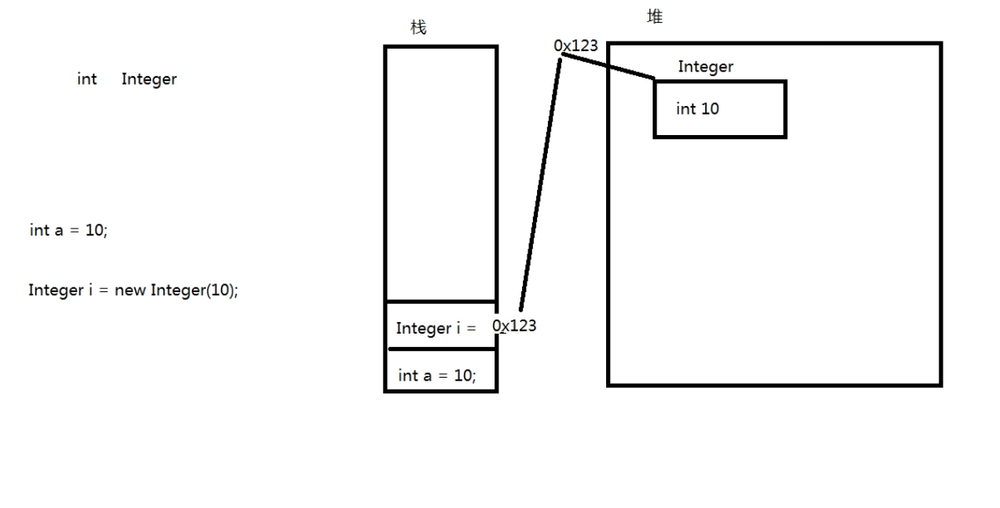
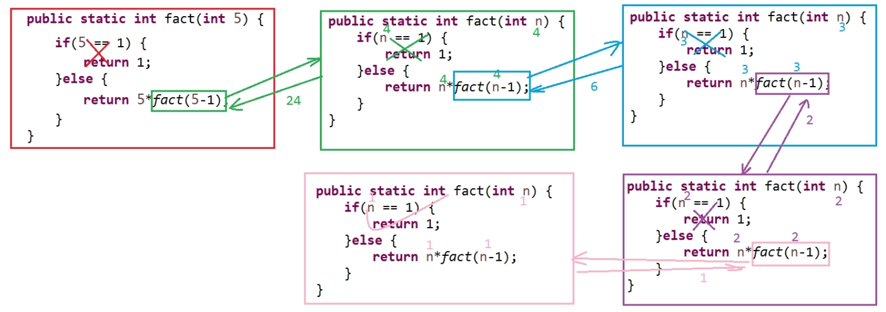

# 3 面向对象高级

## 3.1 继承

继承是Java面向对象编程技术的一块基石，因为它允许创建分等级层次的类。
继承就是子类继承父类的特征和行为，使得子类对象（实例）具有父类的实例域和方法，或子类从父类继承方法，使得子类具有父类相同的行为。

### 3.1.1 继承的格式

```java
class 父类{
    
}
class 子类 extends 父类{
    
}
```

### 3.1.2 实例

```java
package com.xxx.xxx;

public class Demo {

	public static void main(String[] args) {
		Student student = new Student();
		student.setName("张三");
		student.setAge(18);
		student.setSchool("青岛十七中");
		student.say();
        // 输出
        // "我是学生，姓名：张三，年龄：18, 学校：青岛十七中"
	}

}
// 父类
class Person{
    // 父类成员属性
	private String name;
	private int age;
    // 构造方法
	public Person(String name, int age) {
		super();
		this.name = name;
		this.age = age;
	}
	public Person() {
		super();
	}
    // getter & setter
	public String getName() {
		return name;
	}
	public void setName(String name) {
		this.name = name;
	}
	public int getAge() {
		return age;
	}
	public void setAge(int age) {
		this.age = age;
	}
    // 公有方法，输出信息
	public void say() {
		System.out.println("我是：" + name + "，年龄：" + age);
	}
}
// 子类
class Student extends Person{
    // 子类成员属性
	private String school;
	// 构造方法（无参、一参、全参）
	public Student() {
		super(); // 调用父类无参构造方法
	}
	public Student(String school) {
		this(); // 调用子类无参构造
		this.school = school;
	}
	public Student(String name, int age, String school) {
		super(name, age); // 调用父类全参构造方法
		this.school = school;
	}
    // getter & setter
	public String getSchool() {
		return school;
	}
	public void setSchool(String school) {
		this.school = school;
	}
	// 重写了父类的say()方法，输出信息
	public void say() {
		System.out.println("我是学生，姓名：" + super.getName() + "，年龄：" + super.getAge() + ", 学校：" + this.school); // super关键字访问父类的公有方法
	}	
}
```

### 3.1.3 继承的限制

Java中只有单继承和多重继承，没有多继承(C++)，即一个子类只能有一个父类。

### 3.1.4 内存分析

在进行继承的时候，创建子类对象时，子类对象的实例化过程：

视频：04_子类实例化内存分析.mp4 [03:50]

子类创建时：

```java
Student s = new Student();
```

- 在栈中即创建了引用```Student s```，JVM将先查看```Student```类有哪些父类，如此例有父类```Person```类，则先在堆中创建```Person```对象的空间，然后再在堆中创建```Student```对象空间；

- 在```Student```类中创建引用```super```，```super```可理解为变量或属性，其值赋为```Person```对象的内存空间地址，```Person```的一切属性和方法均可以通过```super```访问；

  ```java
  s.setName("张三");
  ```

- 当调用```s.setName("张三")```时，JVM将先查看子类```Student```中是否有该方法，若有，则为重写(Override)了父类方法或者是子类的独有方法，调用该方法执行；若无，则将使用```super```调用父类中的该方法。即实际上的调用应表达为```s.super.setName("张三")```（**<u>仅供理解，实际上在```main```中或其它使用该子类的对象实例的程序逻辑中不能这样使用```super```关键字，因其仅在子类中有指向其自动创建的父类实例的意义，在其它位置中如此使用将会报错</u>**；~~且并不存在```super```关键字前有 “.” 的情况，```this```亦如此；因```this```意义在于指向本类此次创建的此对象实例，```super```意义在于指向所在子类创建时自动创建的对应的父类对象实例，任何通过 “.” 调用```this```或者```super```的方式都是不合逻辑的~~：见 **内部类**），并且实际上```name```变量及其值是存储在父类```Person```的实例化对象中的。调用其它方法同理。


即：所谓的继承，只是子类拥有了父类的内存地址而已。

另外，考虑到权限修饰符，仅父类的```public```和```protected```权限的属性和方法能被子类通过```super```访问，再考虑到封装，即一般情况下子类仅可访问父类的公有方法(```getter```以及```setter```等)，父类的成员属性一般会以```private```封装，是无法直接通过```super```关键词直接访问的。

## 3.2 ```super```关键字

### 3.2.1 通过```super```访问父类的构造方法

子类通过```super```访问父类的构造方法以先实例化父类，其默认是采用**无参构造方法**实例化父类；
若父类中仅有带有参数的构造方法，则子类中必须使用```super```明确指定使用哪个父类中的构造方法(通过给定对应的参数列表指定)，否则程序报错。

实际上任何的类，其构造方法中都存在```super()```，只是通常被省略了，因为所有的类其默认的的父类都是Object类；而人为编写的父类和子类，在子类的构造方法中也无需明示```super()```，但实际上也是省略写法，因为实例化子类之前必须先实例化父类，如3.1.2中的实例，子类```Student```中的无参和一参构造方法改写为如下的代码，程序也能正常运行：

```java
...
	public Student() {}
	public Student(String school) {
		this.school = school;
	}
...
```

通过```super(参数列表)```在子类中指定使用父类的某一构造方法，其作用之一就是在创建子类时对子类继承自父类的成员属性进行默认赋值，如3.1.2中的实例，子类```Student```中的无参构造方法改写为如下方式：

```java
	public Student(){
		super("无名称", 1);
	}
```

则在main方法中创建子类时，即便不给定子类```Student```继承自父类```Person```的```name```以及```age```成员属性，其仍然有默认值而非null与0：

```java
	Student s = new Student();
	s.setSchool("青岛十七中");
	s.say();
// 输出：
// "我是学生，姓名：无名称，年龄：1, 学校：青岛十七中"
```

#### **注意**

- 使用```super(参数列表)```指定调用父类某一构造方法的代码，必须写在子类构造方法的**第一行**；
- 使用```super()```调用父类无参构造方法的代码，若有，也必须在子类构造方法的第一行，但可以省略（省略之后其实也是默认在该构造方法的所有逻辑语句之前执行）；
- 类比使用```this()```调用同类的其它构造方法（也需要放在发起调用的构造方法的第一行）：
  **既调用```this()```又调用```super()```的构造方式，是不符合逻辑也不合常理的**！
  如果使用```this()```调用了同类中的其它构造方法，则可在被调用的构造方法中使用```super()```调用父类的构造方法；如果在某一构造方法中已经使用```super()```调用了父类构造方法，则不需要也不允许再使用```this()```调用同类的其它构造方法。

### 3.2.2 通过```super```访问父类的属性

```super```可以被视为是变量或者对象名称，指向父类的（引用）变量，故当然可以通过```super```访问父类的（```public```或```protected```权限的）属性，例如，在3.1.2的父类```Person```中添加```public```修饰的成员属性：

```java
	public Person(){
	// ...
		public String sex;
	// ...
    }
```

则在子类```Student```中则可通过```super.xxx```的方式调用或修改父类公有属性值：

```java
	public Student(){
        // 调用父类构造方法，必须放在子类构造方法第一行
        super("无名称", 1);
        // 此处是使用super关键字调用父类公有属性，没有位置的要求，需要区别于调用父类构造方法
        super.sex = "男";
    }
```

### 3.2.3 通过```super```调用父类方法

在子类中可以通过```super.xxx()```的方式调用父类的公有方法，例如：

```java
	public Student(){
        super("无名称", 1);
        super.sex = "男";
        // 修改默认名称
        super.setName("默认名称");
    }
```

### 3.2.4 子类实例化创建的父类实例

注意：子类创建了几个实例，相应的就会自动创建几个父类实例，且为一一对应的关系；这些父类实例不能显式地直接访问，仅可通过子类实例使用（其实在使用子类实例时就是在使用它的对应父类实例了）。

## 3.3 重写 override

重写(override)指的是父类的成员方法被子类中的同名、同参数列表和同类型返回值但有不同业务逻辑的新方法覆盖代替。子类实例调用该名称方法时，将使用子类的方法，不使用父类的方法。

### 3.3.1 重写的规则

1. 方法名必须完全相同（不同不构成重写，不报错）。
2. 参数列表必须完全与被重写方法的相同（满足1不满足2，可视作再次声明，不报错，注意这种情况也不是重载）。
3. 返回值类型必须完全与被重写方法的返回值类型相同（满足12不满足3将报错）。
4. 访问权限不能比父类中被重写的方法的访问权限更低（满足123不满足4将报错）。
   例如：如果父类的一个方法被声明为```public```，则在子类中重写该方法就不能声明为```protected```。
5. 父类的成员方法只能被它的子类重写。
6. 声明为static和private的方法不能被重写，但是能够被再次声明（静态方法与对象没有关系，也不能继承；子类不能直接调用父类的private方法，也不能重写）。

### 3.3.2 实例

```java
package demo.demo2;

public class Demo2 {
	
	// 重写与再次声明
	
	public static void main(String[] args) {
		Student2 s = new Student2();
		s.say();
	}
}

class Person2{
	
	private void printSay() {
		System.out.println("锄禾日当午，汗滴禾下土");
	}
	
	public void say() {
		printSay();
	}
	
}

class Student2 extends Person2{
	
	// 再次声明，private方法不能被重写
	private void printSay() {
		System.out.println("窗前明月光，玻璃好上霜。要不及时擦，整不好得脏");
	}
	
	// 重写
	public void say() {
		printSay();
	}
}
```

注意与重载区分：

```java

package demo.demo2;

public class Demo2 {
	
	// 看起来很像重载但不是，因重载发生在同一个类中，现在为父子两个类
    // 亦完全不构成重写
	
	public static void main(String[] args) {
		Student2 s = new Student2();
		s.say();
		String saySth = "窗前明月光，玻璃好上霜。要不及时擦，整不好得脏";
		System.out.println(s.say(saySth));
        // 输出:
        // "锄禾日当午，汗滴禾下土" (调用父类的say())
        // "窗前明月光，玻璃好上霜。要不及时擦，整不好得脏" (调用子类的say(String s))
        // "1" (子类的say(String s)的返回值)
	}
}

class Person2{
	
	private void printSay() {
		System.out.println("锄禾日当午，汗滴禾下土");
	}
	
	public void say() {
		printSay();
	}
	
}

class Student2 extends Person2{
	
	// 再次声明
	private void printSay(String s) {
		System.out.println(s);
	}
	
	// 再次声明
	public int say(String s) {
		printSay(s);
		return 1;
	}
}
```

### 3.3.3 实际应用场景举例

父类的各个功能可能是执行程序的流程，如：向服务器存取数据的流程，包括如何连接数据库、如何告知服务器访问权限的账号和密码、要求服务器执行的是什么操作（即具体指令的发送）以及后期关闭服务器链接的操作：

以上的场景可将父类功能设计为4个方法以操作数据库，子类继承该父类，子类执行的指令可能与父类不同，如子类可能是向服务器存储数据，而父类可能是读取数据，此时就可以将该方法在子类中重写以实现新的功能。

### 3.3.4 与重载 overload 的区别（面试题）

1. 发生的位置：
   重载：一个类中
   重写：子父类中
2. 参数列表的限制：
   重载：必须不同（长度、类型、类型顺序）
   重写：必须相同
3. 返回值类型：
   重载：与返回值类型无关
   重写：返回值类型必须一致
4. 访问权限：
   重载：与访问权限无关
   重写：子的访问权限必须不能低于父类的访问权限
5. 异常处理：
   重载：与异常无关
   重写：可以减少或删除（更精准）即异常范围可以更小，但是不能抛出新的异常

重写：用在子类继承父类的方法时父类的方法不适用则子类声明一个新的方法，调用时使用子类的新的方法逻辑。

## 3.4 ```final```关键字

### 3.4.1 ```final```用于修饰属性、变量

- ```final```关键字修饰的变量成为常量，无法进行更改（增减重新赋值等），若欲进行修改操作将会报错：
  变量成为了常量，无法对其再次进行赋值。
- 对于局部变量：如果创建时未进行赋值，则仅可对其赋值**一次**，可以先声明再赋值（两个独立语句）；
- 对于成员变量：因数据类型存在默认值，若声明时不给定值，则将会被定义为默认值且再也无法改变，不合理，故会报错，即必须在声明时就赋值。
- 全局常量（```public static final```）：在工程的任何位置均可以访问的常量。
- 常量的命名规范：
  由一个或多个单词组成，单词与单词之间必须使用”_"隔开，单词中所有字母均大写
  例如：对数据库进行插入操作的指令 ```SQL_INSERT```

### 3.4.2 ```final```用于修饰类

```final```修饰的类不可以被继承

### 3.4.3 ```final```用于修饰方法

```final```修饰的方法不能被子类重写

## 3.5 抽象类

抽象类的行为是模糊的、不确定的。

### 3.5.1 概念

抽象类必须使用```abstract class```声明
一个抽象类中可以没有抽象方法。抽象方法必须写在抽象类或者接口中。

格式：

```java
abstract class 类名{
    
}
```

### 3.5.2 抽象方法

只声明而未实现的方法称为抽象方法（未实现指的是：没有“{}”方法体），抽象方法必须使用```abstract```关键字声明。

格式：

```java
abstract class 类名{
    // 抽象方法，只声明而未实现
    public abstract void 方法名();
}
```

### 3.5.3 不能被实例化

在抽象类的使用中有几个原则：

- 抽象类本身是不能直接进行实例化操作的，即：不能直接使用关键字```new```完成。
- 一个抽象类必须被子类所继承，被继承的子类（如果不是抽象类）则必须覆写(重写)抽象类中的全部抽象方法。

### 3.5.6 常见问题

1. 抽象类能否使用```final```声明？
   不能，因为```fina```l属修饰的类是不能有子类的 ， 而抽象类必须有子类才有意义，所以不能。
2. 抽象类能否有构造方法？
   能有构造方法，而且子类对象实例化的时候的流程与普通类的继承是一样的，都是要先调用父类中的构造方法（默认是无参的），之后再调用子类自己的构造方法。

### 3.5.7 抽象类和普通类的区别

1. 抽象类必须用```public```或```protected```修饰（如果为```private```修饰，那么子类则无法继承，也就无法实现其抽象方法）。默认缺省为```public```。
2. 抽象类不可以使用```new```关键字创建对象， 但是在子类创建对象时， **抽象父类也会被JVM实例化**（不能人为实例化）。
3. 如果一个子类继承抽象类，那么必须实现其所有的抽象方法。如果有未实现的抽象方法，那么子类也必须定义为```abstract```类。

### 3.5.8 实例

```java
package demo.demoAbstractClass;

public class Demo {

	public static void main(String[] args) {

		Student s = new Student(18);
		s.say();
		
		Nurse n = new Nurse(22);
		n.say();

	}

}
```

```java
package demo.demoAbstractClass;

/**
 * 抽象类
 * */
public abstract class Person {
	
	private int age;
    
    // 构造方法
  	public Person(){
        System.out.println("构造方法执行了");
    }
	
	// 抽象方法
	public abstract void say();
	
	// 实现方法
	public int getAge() {
		return age;
	}
	
	// 实现方法
	public void setAge(int age) {
		this.age = age;
	}

}
```

```java
package demo.demoAbstractClass;

public class Student extends Person {
	
	public Student(int age) {
		super();
		super.setAge(age);
	}

	@Override
	public void say() {
		System.out.println("我是学生，好好学习天天向上，我的年龄：" + super.getAge());
	}

}
```

```java
package demo.demoAbstractClass;

public class Nurse extends Person {
	
	public Nurse(int age) {
		super();
		super.setAge(age);
	}

	@Override // 注解，可检查是否为重写方法
	public void say() {
		System.out.println("我是护士，我的技术棒棒哒，我的年龄：" + super.getAge());
	}

}
```

输出：

```
构造方法执行了
我是学生，好好学习天天向上，我的年龄：18
构造方法执行了
我是护士，我的技术棒棒哒，我的年龄：22
```

### 3.5.9 抽象类的实际应用场景

假设需要编写一个程序，超市进销存系统（进货数量，卖出数量，存货数量的数据进行存储和处理的系统）：

假设可以明确，存货时数据如何获取、数据在显示时如何读取，即该两个功能已经可以实现，但存在不明确的地方，即数据如何存储，如使用数据库还是本地文件存储，尚不确定；

即整体程序流程中，关于进货存储和查询存储结果的流程中，很多操作是确定的，但唯独存储时用何种方式不确定，不能因为整个项目中这一点不明确而耽误整个项目的开发进程，此时即可以使用抽象类，先编写抽象的部分，将需要使用的功能逻辑先封装在抽象类中，其实现可以留待以后完成，而不影响其它部分的开发实现。

实际上对于抽象类的使用，机会比较少，较常用的为接口（Interface），比抽象类更加抽象。

## 3.6 编程规范

一个.java文件中只编写一个类class，且该类必须通过public修饰

## 3.7 接口

### 3.7.1 概念

如果一个类中的全部方法都是**抽象方法**，全部属性都是**全局常量**，那么此时就可以将这个类定义成一个接口。

定义格式：

```java
interface 接口名称{
    全局常量 ;
    抽象方法 ;
}
```

### 3.7.2 面向接口编程思想

这种思想是接口是定义（规范，约束）与实现（名实分离的原则）的分离。

优点：

1. 降低程序的耦合性（模块与模块之间的粘性，粘性越大，一方出问题，另一方越容易出问题）
2. 易于程序的扩展（程序的升级）
3. 有利于程序的维护（功能更改和bug修复等）

项目在开始时即通过抽象的方法，先定义规范、约束，将程序大概有哪些功能通过接口描述出来，有哪些方法也通过抽象描述出来，即从宏观的角度设计好程序的框架，即使程序流程中尚且没有任何用于实现的代码。这样，如果某环节出错或某些部分或模块需要更换或者升级，替换掉这些部分将不会影响其它部分和模块。

结合“多态”思想，类与类之间、模块之间的交互可使用接口的定义来实现。

### 3.7.3 全局常量和抽象方法的简写

因为接口本身都是由全局常量和抽象方法组成 ， 所以接口中的成员定义可以简写：

1. 全局常量编写时， 可以省略```public static final``` 关键字，例如：
   ```public static final String INFO = "内容";```
   简写后：
   ```String INFO = "内容";```
2. 抽象方法编写时， 可以省略 ```public abstract ```关键字， 例如：
   ```public abstract void print();```
   简写后：
   ```void print();```

### 3.7.4 接口的实现 implements

接口可以多实现：

格式：

```java
class 子类 implements 父接口1, 父接口2...{
    
}
```

以上的代码称为接口的实现。那么如果一个类即要实现接口，又要继承抽象类的话，则按照以下的格式编写即可：

```java
class 子类 extends 父类 implements 父接口1, 父接口2...{
    
}
```

### 3.7.5 接口的继承

接口因为都是抽象部分， 不存在具体的实现， 所以允许多继承,例如：

```java
interface 接口 extends 父类1, 父类2...{
    
}
```

### 3.7.6 注意

如果一个接口要想使用，必须依靠子类。 

子类（如果不是抽象类的话）要实现接口中的所有抽象方法。

子类若是抽象类，可不实现接口中所有的抽象方法。

### 3.7.7 接口和抽象类的区别

1. 抽象类要被子类继承，接口要被类实现（实现类）。
2. 接口只能声明抽象方法，抽象类中可以声明抽象方法，也可以写非抽象方法。
3. 接口里定义的变量只能是公共的静态的常量，抽象类中的变量是普通变量。
4. 抽象类使用继承来使用， 无法多继承。 接口使用实现来使用， 可以多实现。
5. 抽象类中可以包含static方法 ，但是接口中不允许（静态方法不能被子类重写，因此接口中不能声明静态方法）。
6. 接口不能有构造方法，但是抽象类可以有。

### 3.7.8 实例

```java
package demo.demoInterface;

public class Demo {
	public static void main(String[] args) {
		Student s = new Student();
		s.say();
        // 多态
		Person p = new Student();
		p.say();
	}
}
```

```java
package demo.demoInterface;

public interface Person {
	void say();
}
```

```java
package demo.demoInterface;

public class Student implements Person {

	@Override
	public void say() {
		System.out.println("锄禾日当午，汗滴禾下土 by"
				+ " infterface");
	}

}
```

输出：

```
锄禾日当午，汗滴禾下土 by infterface
锄禾日当午，汗滴禾下土 by infterface
```

## 3.8 多态

### 3.8.1 概念

多态：就是对象的多种表现形式，（多种体现形态）

### 3.8.2 多态的体现

**对象的多态**性，从概念上非常好理解，在类中有子类和父类之分，子类就是父类的一种形态 ，对象多态性就从此而来。

方法的重载 和 重写 也是多态的一种， 不过是**方法的多态**（相同方法名的多种形态）。
重载： 一个类中方法的多态性体现
重写： 子父类中方法的多态性体现。

### 3.8.3 多态的使用

类似于基本数据类型的转换：

- 向上转型：将子类实例变为父类实例
  	|- 格式：父类 父类对象 = 子类实例 ；
      （父类引用指向子类对象）
- 向下转型：将父类实例变为子类实例
      |- 格式：子类 子类对象 = （子类）父类实例 ；（强制转换）

注意：强制转换可能造成错误，若左侧的子类对象的类型并非右侧父类对象实际指向的子类类型，则将导致转换失败！

例如，有如下抽象类及其子类的代码：

```java
package demo.demoMultiCondition;

public abstract class Person {
	public abstract void say();
}
```

```java
package demo.demoMultiCondition;

public class Student extends Person {
	@Override
	public void say() {
		System.out.println("我是学生，好好学习天天向上");
	}
}
```

```java
package demo.demoMultiCondition;

public class Nurse extends Person {
	@Override
	public void say() {
		System.out.println("我是护士，我的技术棒棒哒");
	}
}
```

在另一个java文件的main方法中使用如下代码调用上述类，程序正常运行：（向上转型）

```java
Student a = new Student();
Nurse b = new Nurse();
		
Person p1 = a;
Person p2 = b;
p1.say();
p2.say();
```

输出：

```
我是学生，好好学习天天向上
我是护士，我的技术棒棒哒
```

若在该java文件中的```main```方法中使用如下代码，则将抛出异常：

```java
Student a = new Student();
Nurse b = new Nurse();

Person p1 = a;
Person p2 = b;

Student a2 = (Student) p1;
Student a3 = (Student) p2; // 抛出异常
```

异常信息：

```
Exception in thread "main" java.lang.ClassCastException: class demo.demoMultiCondition.Nurse cannot be cast to class demo.demoMultiCondition.Student (demo.demoMultiCondition.Nurse and demo.demoMultiCondition.Student are in unnamed module of loader 'app')
	at demo.demoMultiCondition.Demo.main(Demo.java:16)
```

即 ```Nurse``` 类 无法转换为 ```Student``` 类，虽然表面上它们都被转换为 ```Person```类了，但其实其各自指向的仍然是子类```Student ```和 ```Nurse```。

### 3.8.4 多态的实际应用场景

面向接口编程，方法传递的对象可以为一个接口类型，如以下代码：

```java
package demo.demoInterface;

public interface Person {
	void say();
}
```

```java
package demo.demoInterface;

public class Student implements Person {
	@Override
	public void say() {
		System.out.println("锄禾日当午，汗滴禾下土");
	}
}
```

在调用上述类和接口的类中，需要声明一个以接口```Person```为形参的方法：

```java
public static void say(Person p){
    p.say();
}
```

在```main```方法中，声明并建立```Student```类的实例化对象并调用上述```say()```方法：

```java
public static void main(String[] args){
    Student s = new Student();
    say(s);
}
```

输出：

```
锄禾日当午，汗滴禾下土
```

此例中，传入的虽为```Student```，但被cast为```Person```的实例化对象（向上转型），为多态的一个实际应用场景。

假设以后因为功能的更改等需要，Student类被认为不适用于上述场景，则真正执行逻辑的代码

```java
public static void say(Person p){
    p.say();
}
```

无需更改，只需要再新建一个类：

```java
package demo.demoInterface;

public class Nurse implements Person {
	@Override
	public void say() {
		System.out.println("后续增加的类，来自护士");
	}
}
```

再更改main中的声明与实例化对象及传参：

```java
public static void main(String[] args){
    Nurse n = new Nurse();
    say(n);
}
```

即可正常运行新的功能，输出：

```
后续增加的say，来自护士
```

## 3.9 ```instanceof```

作用：判断某个对象是否是指定类的实例，则可以使用```instanceof```关键字

格式：实例化对象 ```instanceof``` 类 //此操作返回```boolean```类型的数据

实例：处理3.8.3中抛出的异常

```java
package demo.demoMultiCondition;

public class Demo2 {
	public static void main(String[] args) {
		Nurse n = new Nurse();
		say(n);
		Student s = new Student();
		say(s);
	}
	public static void say(Person p) {
		// 使用instanceof判断传入的对象是此类型的哪种形态（哪个子类的对象）
		if (p instanceof Student) {
			Student s = (Student) p;
			s.say();
		} else {
			System.out.println("必须传入学生形态才可以执行");
		}
		
	}
}
```

输出：

```
必须传入学生形态才可以执行
我是学生，好好学习天天向上
```

## 3.10 ```Object```类

### 3.10.1 概念

Object类是所有类的父类（基类），如果一个类没有明确的继承某一个具体的类，则将默认继承Object类。

例如我们定义一个类：

```java
public class Person{
}
```

其实它被使用时 是这样的：

```java
public class Person extends Object{
}
```

### 3.10.2 ```Object```的多态

使用```Object```可以接收**任意的引用数据类型**~~（和基本数据类型？）~~。

从多态的角度来看，java代码运行中产生的所有的实例（万物）都可以看作是```Object```类的对象。

例如：

```java
package demo.demoObject;

public class Demo {
	public static void main(String[] args) {
		String text = "123";
		say(text);
		int a = 10;
		say(a);
	}
	public static void say(Object o) {
		System.out.println(o);
	}
}
```

此即 ”万物皆对象“。。。

**注意：**
此处虽然传入了int a整型，实际上经过了一次(默认)装箱操作，将整型装箱为Integer类的包装类对象进行Object传参（参见3.12 包装类）。

### 3.10.3 如何使用API

在eclipse中，若需要查看类的源码，按住Ctrl键在相应的类上面点鼠标左键即可:


独立版本API查询：

- **JDK 11 API中文帮助文档.CHM** 
  中文版为谷歌翻译生成，不推荐，仅供参考
- JDK11 API官方原版（从oracle官网下载）
  **jdk-11.0.9_doc-all.zip** （已下载）
  下载地址：https://www.oracle.com/java/technologies/javase-jdk11-doc-downloads.html
  总链接：https://www.oracle.com/java/technologies/javase-downloads.html
  推荐参阅，若本地查阅，需要使用CHMWriter将zip包转换为CHM文件使用
  CHMWriter GitHub地址：https://github.com/jptiancai/javadoc2chm
  ~~CHMWriter 下载地址：https://www.onlinedown.net/soft/973877.htm~~ (下载的文件无法使用)
  ~~使用指南：https://blog.csdn.net/qq_34896199/article/details/107201889~~
- 线上文档：https://docs.oracle.com/en/java/javase/11/docs/api/index.html

### 3.10.4 ```toString()```

建议重写```Object```中的```toString```方法。 此方法的作用：返回对象的字符串表示形式。

```Object```的```toString```方法， 返回对象的内存地址:```Class名@内存地址```，如以下的类：

```java
package demo.demoToStringCustomized;

public class Person {
	private String name;
	private int age;
	public Person(String name, int age) {
		super();
		this.name = name;
		this.age = age;
	}
	public Person() {
		super();
	}
	public String getName() {
		return name;
	}
	public void setName(String name) {
		this.name = name;
	}
	public int getAge() {
		return age;
	}
	public void setAge(int age) {
		this.age = age;
	}
	
}
```

使用控制台输出该类的对象时：

```java
package demo.demoToStringCustomized;

public class Demo {
	public static void main(String[] args) {
		Person p = new Person("张三", 22);
		System.out.println(p);
	}
}
```

若无重写，控制台打印对象实际上调用的是```String.valueOf(obj)``` => ```Object.toString()```(对象非空)，其输出结果为：

```
demo.demoToStringCustomized.Person@2d363fb3
```

因其在大部分场景中并不能很好的以文字形式描述一个类的对象实例，故建议每个类在编写时都重写该方法，**通过文字更详细地描述对象的信息**，即在上述```Person```类中加入以下的新方法:

```java
	public String toString() {
		return "类名：Person，姓名：" + this.name + "，年龄：" + this.age;
	}
```

运行代码，输出变为：

```
类名：Person，姓名：张三，年龄：22
```

eclipse中有自动生成重写```Object.toString()```方法的快捷方式(右键菜单source选项中，快捷键为shift+alt+s)，其默认格式为"```类名 [属性名=属性值 (逗号隔开的列表)]```":

```java
	@Override
	public String toString() {
		return "Person [name=" + name + ", age=" + age + "]";
	}
```

注释掉上述自定义的```toString()```改用eclipse生成的```toString()```，输出为：

```
Person [name=张三, age=22]
```

### 3.10.5 ```equals(Object obj)```

建议重写```Object```中的```equals(Object obj)```方法，此方法的作用：指示某个其他对象是否“等于”此对象。

```Object```的```equals```方法：实现了对象上最具区别的可能等价关系; 也就是说，对于任何非空引用值```x```和```y``` ，当且仅当```x```和```y```引用同一对象（ ```x == y``` 具有值 ```true```）时，此方法返回```true```。

以上表述的意义在于，```Object```的```equals(Object obj)```方法，实际上也是使用 ```==``` 进行比较，对于引用数据类型的对象来说，```==``` 比较的实际上是两个对象的内存地址。

如使用3.10.4的```Person```类进行如下的操作：

```java
package demo.demoEquals;

public class Demo {
	public static void main(String[] args) {
		Person p1 = new Person("张三", 18);
		Person p2 = new Person("张三", 18);
		System.out.println(p1==p2);
	}
}
```

其输出结果将为```false```，原因在于使用了两次```new```关键字声明了两个堆中的内存地址，两个地址使用```==```比较结果自然不同（```false```），即代表了两者为两个不同对象，即使其内部的属性完全一致，其结果与使用```Object```类的```equals(obj)```方法也是一致的，如果将上述代码中控制台输出的代码行改为：

```java
		System.out.println(p1.equals(p2));
```

输出将仍然是```false```，因在```Object```类中，```equals(obj)```方法的源码为：

```java
	public boolean equals(Object obj) {
        return (this == obj);
    }
```

以上的功能在实际工程中一般是不能满足需要的，因此，在编写类时建议重写```equals(obj)```方法进行定制，即根据业务逻辑灵活调整比较对象的各项信息，然后输出是否相等的布尔值。

而在重写该方法时，需要满足```equals(obj)```方法重写时的五个特性：

1. 自反性 ：对于任何非空的参考值```x```，```x.equals(x)```应该返回```true```。
2. 对称性 ：对于任何非空引用值```x```和```y```，```x.equals(y)```应该返回```true```，当且仅当```y.equals(x)```返回```true```。
3. 传递性 ：对于任何非空引用值```x```，```y```和```z```，如果```x.equals(y)```返回```true```，```y.equals(z)```返回```true```，则```x.equals(z)```应该返回```true```。
4. 一致性 ：对于任何非空引用值```x```和```y```，多次调用```x.equals(y)```始终返回```true```或始终返回```false``` ，前提是未修改对象的```equals```比较中使用的信息。
5. 非空性 ：对于任何非空的参考值```x``` ，```x.equals(null)```应该返回```false```。

**重写实例：**

使用3.10.4的```Person```类，假设规定依据该类创建的对象，只要其name属性和age属性的值对应相等，则对象为相等，重写代码如下：

```java
	public boolean equals(Object obj) {
		if (this == obj) {
			return true;
		} // 非同一地址
		if (obj == null) {
			return false;
		} // 非空
		if (obj instanceof Person) { // 同类才进行比较
			Person other = (Person) obj; // 强制转换为Person类
			if (this.name.equals(other.name) && this.age == other.age) {
				// 同类且所有属性值都相同
				return true; // 即代表两者为相同，返回true
			} else {
				return false; // 属性值中有不同的，两对象不等，返回false
			}
		} else {
			return false; // 类型不同返回false
		}
	}
```

上述代码可以简化为：

```java
	public boolean equals(Object obj) {
		if (this == obj) {
			return true;
		}
		if (obj == null) {
			return false;
		}
		if (obj instanceof Person) {
			Person other = (Person) obj;
			if (this.name.equals(other.name) && this.age == other.age) {
				return true;
			}
		} 
		return false;
	}
```

此时再调用```p1.equals(p2)```返回值则为```true```。

因上述比较的逻辑比较固定，即比较类中所有属性的值，eclipse中提供了快速生成```equals(obj)```的功能，仍然在右键菜单的source项目下（快捷键shift+alt+s），以上述的```Person```类为例，自动生成的代码为:

```java
	public boolean equals(Object obj) {
		if (this == obj)
			return true;
		if (obj == null)
			return false;
		if (getClass() != obj.getClass())
			return false;
		Person other = (Person) obj;
		if (age != other.age)
			return false;
		if (name == null) {
			if (other.name != null)
				return false;
		} else if (!name.equals(other.name))
			return false;
		return true;
	}
```

## 3.11 内部类

### 3.11.1 概念

在Java中，可以将一个类定义在另一个类里面或者一个方法里面，这样的类称为内部类。
（相对于内部的类，其外部的类则称为外部类。）

广泛意义上的内部类一般来说包括这四种：

1. 成员内部类 [类比成员变量(类的属性)和成员方法]
2. 局部内部类 [类比局部变量，即代码块、方法块等执行体内部的变量]
3. 匿名内部类 [无命名的内部类，只能使用一次]（实际上也是局部内部类的一种）
4. 静态内部类 [在成员内部类的基础上加上静态修饰符修饰的内部类]

*内部类在实际项目中的使用比较少，理解概念即可。*

注意，与一般类的使用相一致，在外部类未创建对象的时候内部类是无法使用的。

### 3.11.2 成员内部类

最普通最简单的内部类，它的定义为位于另一个类的内部，形如下面的形式：

```java
package demo.demoInnerClass;

public class Outer {
    // 外部类的x
	private int x;

	public int getX() {
		return x;
	}
	public void setX(int x) {
		this.x = x;
	}
	
	/**
	 * 成员内部类，非静态，依赖于对象<br>
	 * 对象创建了才能使用<br>
	 * 即内部类可以无条件使用外部类的所有属性和方法，包括私有属性和方法<br>
	 * 因为使用内部类的的时候外部类必定已经创建了对象，否则程序在编写时会报错
	 * */
	class Inner{
        // 内部类的x
		private int x = 200;
		public void say() {
			System.out.println(x);
            // 调用外部类的x
			System.out.println(Outer.this.x);
		}
	}

}
```

特点： 成员内部类可以无条件访问外部类的所有成员属性和成员方法（包括private成员和静态成员）。

不过要注意的是，当成员内部类拥有和外部类同名的成员变量或者方法时，会发生隐藏现象，即默认情况下访问的是成员内部类的成员。如果要访问外部类的同名成员，需要以下面的形式进行访问：

```java
外部类.this.成员变量
外部类.this.成员方法
```

调用上面定义的类：

```java
package demo.demoInnerClass;

public class Demo1 {	
	public static void main(String[] args) {	
		// 创建外部类对象实例
        Outer o = new Outer();
		o.setX(100);
		// 创建内部类对象实例
		Outer.Inner i = o.new Inner();
        // 访问内部类的方法
		i.say();
	}	
}
```

运行输出为：

```
200
100
```

### 3.11.3 局部内部类

局部内部类是定义在一个方法或者一个作用域里面的类，它和成员内部类的区别在于局部内部类的访问仅限于方法内或者该作用域内。

注意：局部内部类就像是方法里面的一个局部变量一样，是不能有```public```、```protected```、```private```以及```static```修饰符的。局部内部类只能访问```final```型的局部变量（解释参见3.11.4 匿名内部类）。

**例1**：开发前期使用接口建立程序框架，内部某一模块需要传入接口，但尚不确定传入该接口的什么实现，可用局部内部类编写接口实现类，再将该实现类的对象传入，以进行接口和传参的测试等：

```java
package demo.demoInnerClass;

public interface Person {
	void say();
}
```

```java
package demo.demoInnerClass;

public class Demo3 {
	public static void main(String[] args) {
		// 一次性使用的实现类
		class PersonImp implements Person{
			@Override
			public void say() {
				System.out.println("新编写的局部内部类的say方法内容");				
			}
		}
		// 在开发前期用于接口实现的测试等
		PersonImp pi = new PersonImp();
		haha(pi);
	}
	// 传入接口的实现类，或者类，或类的子类
	public static void haha(Person p) {
		// 其它程序逻辑代码。。。
	}
}
```

**例2**：使用系统的某个API来演示局部内部类的使用
（注意：Java当下主要用于后端的开发，面向用户的GUI等并非其优势，```java.awt```模块亦不经常使用甚至一般不选择使用了，以下仅作为局部内部类的例子来理解局部内部类，不会经常使用）

```java
package demo.demoInnerClass;

import java.awt.Frame;
import java.awt.event.WindowEvent;
import java.awt.event.WindowListener;

public class Demo4 {
	public static void main(String[] args) {
		Frame frame = new Frame("QQ登陆器");
		frame.setVisible(true);
		frame.setSize(300, 200);
		
        // 使用局部内部类编写接口WindowListener的实现类MyWindowListener
		class MyWindowListener implements WindowListener{
			@Override
			public void windowOpened(WindowEvent e) {
				// TODO Auto-generated method stub
			}
			@Override
			public void windowClosing(WindowEvent e) {
				System.out.println("hahaha");
                // 点击窗口的叉号，控制台将输出 hahaha
			}
			@Override
			public void windowClosed(WindowEvent e) {
				// TODO Auto-generated method stub
			}
			@Override
			public void windowIconified(WindowEvent e) {
				// TODO Auto-generated method stub
			}
			@Override
			public void windowDeiconified(WindowEvent e) {
				// TODO Auto-generated method stub
			}
			@Override
			public void windowActivated(WindowEvent e) {
				// TODO Auto-generated method stub
			}
			@Override
			public void windowDeactivated(WindowEvent e) {
				// TODO Auto-generated method stub
			}	
		}
		// 实例化实现类MyWindowListener为对象listener
		MyWindowListener listener = new MyWindowListener();
        // 将实例对象listener传入.addWindowListener()方法
        // 该方法要求传入一个定制化的接口WindowListener的实现类的对象，
        // java本身不提供该实现类，需要程序员自己去编写实现类
		frame.addWindowListener(listener);
	}
}
```

综上所述，局部内部类（最常用的）场景一般是编写不确定的接口的局部使用的实现类，用于传参等，或者使用在只提供接口，具体实现类不提供，需要高度定制化的场景。

### 3.11.4 匿名内部类

匿名内部类是局部内部类的一种。创建格式：

```java
new 父类构造器(参数列表)|实现接口(){
    // 类体
}
```

匿名内部类**必须**继承一个父类或者实现一个接口，也**只能**继承一个父类或实现一个接口。它没有```class```关键字，因其直接使用new来生成一个对象的隐式引用。

注意：

1. 使用匿名内部类时，我们必须是继承一个类或者实现一个接口，但是两者不可兼得，同时也只能继承一个类或者实现一个接口。

2. 匿名内部类中是不能定义构造函数的。

3. 匿名内部类中不能存在任何的静态成员变量和静态方法。

4. 匿名内部类为局部内部类，所以局部内部类的所有限制同样对匿名内部类生效（如不能有```public```、```protected```、```private```以及```static```修饰符；只能局部生效等）。

5. 匿名内部类不能是抽象的，它必须要实现继承的类或者实现的接口的所有抽象方法。

6. 只能访问```final```型的局部变量：

   实际上所有的局部内部类都**只能**访问```final```型的局部变量。
   这与java的编译模式有关。

   以下代码虽然不报错，但实际上是```int```前省略了```final```关键词 (java 1.8 版本之后可以省略，之前版本必须显式写```final```)：

   ```java
   public class Demo3 {
   	public static void main(String[] args) {
           // 声明变量
           int a = 10;
   		class PersonImp implements Person{
   			@Override
   			public void say() {
   				// 使用a变量
                   System.out.println("新编写的局部内部类的say方法内容" + a);				
   			}
   		}
   		PersonImp pi = new PersonImp();
   		haha(pi);
   	}
   	public static void haha(Person p) {
           
   	}
   }
   ```

   一旦在局部内部类```PersonImp```中使用了a变量，则此变量将在编译时自动被java认为是```final```修饰，声明和初始化赋值之后将不允许再次赋值或进行自增减运算：

   ```java
   ...
   		// 声明变量
       	int a = 10;
   		// 插入下面代码将报错（下面的局部内部类中报错）
   		a = 20;
       	class PersonImp implements Person{
               public void say(){
                   System.out.println("..." + a); // a报错
                   // 因上面的a实际上是final型
               }
           }
   ...
   ```

   该规则限制的原因在于，内部类在执行时，将如同正常的类一样被编译为单独的class文件(字节码文件)，如上述的代码在生成字节码文件时，内部类中的变量```a```出现在```PersonImp```类的字节码文件中，其声明赋值的部分却在外部类的字节码文件中，未进行声明的变量在java中是无法使用的，故在编译时外部a变量的声明和赋值将备份在内部类的字节码文件中，该备份不可更改，而程序运行中，如果外部类中的```a```仍然如同普通变量使用，其值更改后，将与内部类中的a的值不一致导致逻辑错误。因此，局部内部类中只能使用```final```修饰的变量。匿名内部类亦如此。

实例：

将3.11.3中的```Demo3```类更改为如下的```Demo3_2```类(```Person```接口不变)：

```java
package anonymousInnerClass;

public class Demo3_2 {
    public static void main(String[] args) {
        // 等号右侧即为匿名内部类，为Person接口的匿名实现类
        // 因其匿名，故只能使用一次
        Person p = new Person() {
            @Override
            public void say() {
                System.out.println("锄禾日当午");
            }
        };
        haha(p);
    }
    public static void haha(Person p){
		
    }
}
```

### 3.11.5 静态内部类

静态内部类也是定义在另一个类里面的类，只不过在类的前面多了一个关键字```static```。

静态内部类不需要依赖于外部类对象，这点和类的静态成员属性有点类似，并且它不能使用外部类的非```static```成员变量或者方法。

实例：

```java
package staticInnerClass;

public class Book {
    // 静态内部类
    static class Info{
        public void say(){
            System.out.println("这是一个信息类");
        }
    }
}
```

```java
package staticInnerClass;

public class Demo5 {
    public static void main(String[] args) {
        // 直接创建内部类对象，不需要先创建外部类对象
        // 因其是静态的，不依赖于外部类对象
        // 这与成员内部类不同
        Book.Info info = new Book.Info();
        info.say();
    }
}
```

这将导致一个问题，即很可能内部类的对象已经创建了，然而外部类的对象还未创建，因此，**静态内部类不能访问外部类的非静态资源**（变量和方法）。

## 3.12  包装类

图解包装类：

视频：25_包装类.mp4 [00:00:11]



### 3.12.1 概念

在Java中有一个设计的原则“一切皆对象”，那么这样一来Java中的一些基本的数据类型，就完全不符合于这种设计思想，因为Java中的八种基本数据类型并不是引用数据类型，所以Java中为了解决这样的问题，引入了八种基本数据类型的包装类。

| 序号 | 基本数据类型  | 包装类          |
| ---- | ------------- | --------------- |
| 1    | ```int```     | ```Integer```   |
| 2    | ```char```    | ```Character``` |
| 3    | ```float```   | ```Float```     |
| 4    | ```double```  | ```Double```    |
| 5    | ```boolean``` | ```Boolean```   |
| 6    | ```byte```    | ```Byte```      |
| 7    | ```short```   | ```Short```     |
| 8    | ```long```    | ```Long```      |

以上的八种包装类，可以将基本数据类型按照类的形式进行操作。

以上的八种包装类实际上分为两种大的类型：

- ```Number```：```Integer```、```Short```、```Long```、```Double```、```Float```、```Byte```都是```Number```的子类，表示是一个数字。
- ```Object```：```Character```、```Boolean```都是```Object```的直接子类。

如何查看包装类的父类(接口)：

在eclipse中创建包装类，按住Ctrl选中类名，将看到其父类，进入其父类，按住Ctrl+t则可查看该父类(接口)的所有实现类。

以下将展示的方法实际上是```Number```类的抽象方法的实现，故如果要记忆，只需进入接口查看方法即可。

### 3.12.2 装箱和拆箱操作

- 将一个基本数据类型变为包装类，那么这样的操作称为装箱操作；
- 将一个包装类变为一个基本数据类型，这样的操作称为拆箱操作。

因为所有的数值型的包装类都是```Number```的子类，```Number```的类中定义了如下的操作方法，以下的全部方法都是进行拆箱的操作。

| 序号 | 方法                                       | 描述                             |
| ---- | ------------------------------------------ | -------------------------------- |
| 1    | ```public byte byteValue()```              | 用于```Byte``` => ```byte```     |
| 2    | ```public abstract double doubleValue()``` | 用于```Double``` => ```double``` |
| 3    | ```public abstract float floatValue()```   | 用于```Float``` => ```float```   |
| 4    | ```public abstract int intValue()```       | 用于```Integer``` => ```int```   |
| 5    | ```public abstract long longValue()```     | 用于```Long``` => ```long```     |
| 6    | ```public short shortValue()```            | 用于```Short``` => ```short```   |

在JDK1.4之前 ，如果要想装箱，需要使用各个包装类的构造方法，例如：

```java
int tmp = 10; // 基本数据类型
Integer x = new Integer(temp); // 将基本数据类型变为包装类
```

在JDK1.5及之后，Java新增了自动装箱和自动拆箱，而且可以直接通过包装类进行四则运算和自增自建操作。例如：

```java
Float f = 10.3f; // 自动装箱
float x = f; // 自动拆箱
System.out.println(f * f); // 直接利用包装类完成
System.out.println(x * x) ; // 直接利用包装类完成
```

注意：因java的版本迭代，像如下的装箱方法:

```java
Integer i new Integer(200);
```

已经过时(deprecated)，在eclipse等IDE中Integer上将显示删除线(Unnecessary boxing)。

### 3.12.4 字符串转换

使用包装类还有一个很优秀的地方在于：可以将一个字符串变为指定的基本数据类型，此点一般在**接收输入数据**上使用较多。

在Integer类中提供了以下的操作方法：

```java
public static int parseInt(String s) // 将String变为int型数据
```

在Float类中提供了以下的操作方法：

```java
public static float parseFloat(String s) // 将String变为Float
```

在Boolean 类中提供了以下操作方法：

```java
public static boolean parseBoolean(String s) 
// 将String变为boolean
```

... (其它方法参阅JDK的Docs)

注意：输入的字符串必须符合相应的类型，比如```Integer.parseInt("abc")```将会报错。

### 3.12.5 优点和使用场景

- 当方法需要传递Object参数时，早期版本中，需要将基本数据类型装箱为包装类再传参，新版本中不需要显式操作装箱，只要传入基本数据类型都会自动先进行装箱后再传参；
- 提供比基础类型更丰富的方法，如```Integer.parseInt(String s)```等；
- 使基本数据类型与引用数据类型之间的交互变得简单。

## 3.13 可变参数

一个方法中定义完了参数，则在调用的时候必须传入与其一一对应的参数，但是在JDK 1.5之后提供了新的功能，可以根据需要自动传入任意个数的参数。

```java
返回值类型 方法名称(数据类型... 参数名称){
    // 参数在方法内部以数组的方式使用
}
```

实例：

```java
package alterbleVariable;

public class Varargs {

    public static void main(String[] args) {
        System.out.println(sum(100,200));
        System.out.println(sumPro());
        System.out.println(sumPro(1));
        System.out.println(sumPro(1,2));
        System.out.println(sumPro(1,2,3));
        System.out.println(sumPro(1,2,3,4));
        System.out.println(sumPro(1,2,3,4,5));
    }

    public static int sum(int x, int y){
        return x + y;
    }

    // int... nums 表示的是可变参数，调用时可以传递0~n个数字
    public static int sumPro(int... nums){
        int n = 0;
        for (int num : nums) {
            n += num;
        }
        return n;
    }
}
```

注意：可变参数**只能**出现在参数列表的最后(语法规定)，如：

```java
public static void sayAndCalculate(String s, int... nums){
	System.out.println(s);
    int n = 0;
    for (int num : nums) {
        n += num;
    }
    System.out.println(n);
}
```

## 3.14 递归

递归，在数学与计算机科学中，是指在方法的定义中使用方法自身。也就是说，递归算法是一种直接或者间接调用自身方法的算法。

流程图解：


实例：

```java
package recursion;

public class FactorialFive {
    /**
     * 递归实现5的阶乘
     * （一个正整数的阶乘 factorial 是所有小于等于该数的正整数的积）
     * */
    public static void main(String[] args) {
        System.out.println(5 * 4 * 3 * 2 * 1);
        int n = fact(5);
        System.out.println(n);
    }
    public static int fact(int n){
        if (n == 1){
            return 1;
        } else {
            return n * fact(n-1);
        }
    }
}
```

图解上述代码的执行流程：



注意：

- 不合理的递归很容易造成栈内存溢出（方法入栈，方法在栈内存加载，栈内存一般只有不到2MB大小）。
- 若无正确地返回，方法将在重复嵌套等待导致内存持续占用。
- 能使用循环完成的功能尽量不要使用递归，因为递归的效率太低，重复调用会造成大量的（使用其它方式可能不会产生的）资源损耗，因为存在方法的重复嵌套等待。

练习：使用递归打印自然数中前n个Fibonacci数:

```java
package recursion;

public class Fibonacci {
    public static void main(String[] args) {
        for (int i = 0; i < 8; i++) {
            System.out.println(fibonacci(i + 1));
        }
    }
    public static int fibonacci(int n){
        if (n == 1 || n == 2){
            return 1;
        } else {
            return fibonacci(n - 1) + fibonacci(n - 2);
        }
    }
}
```

# 问题汇总：

类的继承：父类未给定无参构造方法只给定全参方法，子类会提示错误，需要使用super()指定使用父类的某一构造方法。

概念区分：对象 Object 与 实例 Instance？
一般等而视之，也有理解对象为存储在栈中的引用名称而实例为存储在堆中的实例的，不需纠结于此。

问题：继承中，父类的private修饰的成员属性能够被子类继承，为何private的方法不能继承？
都继承了，只是不能通过子类从外部直接访问 (子类实例名.成员属性 或 子类实例名.private方法 - 子类自己的private方法也不能如此访问)，public方法中若有调用父类的private方法来实现某些功能，也是可以正常使用的。

问题：Object传参，只能传递引用数据类型还是也可以传递基本数据类型？
传递引用数据类型，当传递基本数据类型时将进行一次默认的装箱操作，装箱为基本数据类型的包装类的对象，再进行Object传参。