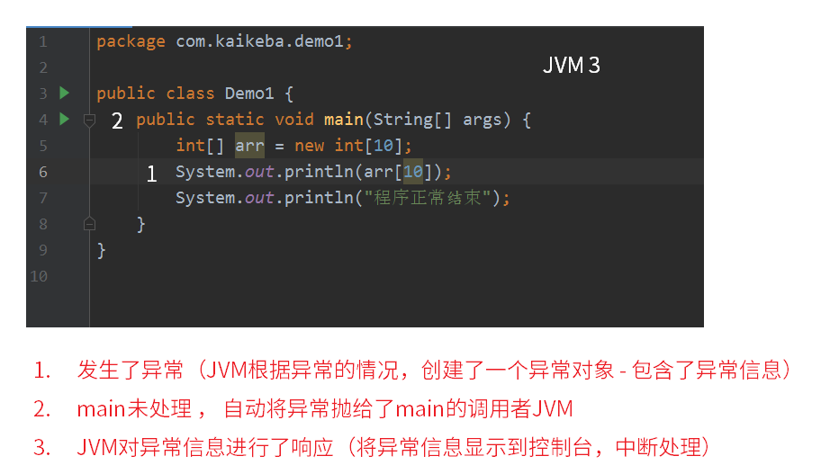

# 异常

## 1 概念

异常是在程序中导致程序中断运行的一种指令流。比如以下的代码：

```java
public class Demo1 {
    public static void main(String[] args) {
        int i = 10;
        int j = 0;
        System.out.println("====开始计算====");
        int tmp = i / j;
        System.out.println(tmp);
        System.out.println("====计算结束====");
    }
}
```

运行结果：

```java
====开始计算====
Exception in thread "main" java.lang.ArithmeticException: / by zero
	at com.java.demoException.Demo1.main(Demo1.java:8)
```

以上的代码在```int temp = i / j ;```位置处产生了异常，一旦产生异常之后，异常之后的语句将不再执行了，所以现在的程序并没有正确的执行完毕之后就退出了。

那么，为了保证程序出现异常之后仍然可以正确的执行完毕，所以要采用异常的处理机制。

## 2 处理异常 (捕获并处理异常)

如果要想对异常进行处理，则必须采用标准的处理格式，处理格式语法如下：

```java
try{
	// 有可能发生异常的代码段
}catch(异常类型1 对象名1){
	// 异常的处理操作
}catch(异常类型2 对象名2){
    // 异常的处理操作
} ...
finally{
	// 异常的统一出口
}
```

### 2.1 try ... catch 的处理流程

1. 一旦产生异常，则系统会自动产生一个异常类的实例化对象。
2. 那么，此时如果异常发生在try语句，则会自动找到匹配的catch语句执行，如果没有在try语句中，则会将异常抛出。
3. 所有的catch根据方法的参数匹配异常类的实例化对象，如果匹配成功，则表示由此catch进行处理。



### 2.2 finally

在进行异常的处理之后，在异常的处理格式中还有一个finally语句，那么此语句将作为异常的统一出口，不管是否产生了异常，最终都要执行此段代码。

finally使用举例：（类比 2.4 异常处理的第3种写法）

```java
package com.java.demoException;

import java.util.InputMismatchException;
import java.util.Scanner;

public class Demo1 {
    public static void main(String[] args) {
        haha();
        System.out.println("程序执行完毕");
    }
    private static void haha(){
        try {
            Scanner input = new Scanner(System.in);
            System.out.println("请输入一个数字");
            int x = input.nextInt();
            System.out.println("请再输入一个数字");
            int y = input.nextInt();
            System.out.println(x / y);
        } catch (RuntimeException e) {
            System.out.println("输入错误");
        } finally {
            // 必然执行的异常统一处理出口
            // 无论是否发生异常，finally必然执行
            System.out.println("finally执行完毕");
        }
    }
}
```

#### finally的使用场景举例：

GC垃圾回收回收的是内存垃圾，不涉及其它的资源，如文件占用或蓝牙等硬件无法通过GC释放。比如在try...catch中，文件读取一半产生异常，也需要释放占用文件的句柄，否则文件将无法被其它程序访问。此时可将释放文件的语句放在finally块中，此语句块是**必然执行的异常统一处理出口**，即无论是否发生异常，finally必然执行。**网络编程，IO处理和数据库操作的释放操作必须放置于finally中**。

#### finally面试常见问题：

关于面试题中比较常问的关于finally的问题，见本文件 **7 异常处理常见面试题** 和 **finally面试问题.md** 文件。

### 2.3 特殊的多异常捕获写法

```java
catch(异常类型1 | 异常类型2 对象名){
	//表示此块用于处理异常类型1 和 异常类型2 的异常信息
}
```

该写法的实际使用较少。

多异常捕获特殊写法实例：（类比2.5 异常处理 案例1）

```java
package com.java.demoException;

import java.util.InputMismatchException;
import java.util.Scanner;

public class Demo1 {
    public static void main(String[] args) {
        haha();
        System.out.println("程序执行完毕");
    }
    private static void haha(){
        try {
            Scanner input = new Scanner(System.in);
            System.out.println("请输入一个数字");
            int x = input.nextInt();
            System.out.println("请再输入一个数字");
            int y = input.nextInt();
            System.out.println(x / y);
        } catch (InputMismatchException | ArithmeticException e) {
            System.out.println("输入错误");
        }
    }
}
```

### 2.4 异常处理的第3种写法：

这种写法的使用较多。扩大异常形态的范围（更粗的异常）。

2.3 中的实例中的异常```InputMismatchException```与```ArithmeticException```均为```RuntimeException```的子类，可利用多态性（子类是父类的不同形态）进行异常的捕获，即将上述代码的```catch```行修改为如下即可：

```java
...
		} catch (RuntimeException e) {
...
```

注意：使用```RuntimeException```的超类(父类)```Exception```进行异常捕获，虽然可以捕获所有的异常，但很难进行针对性的有效处理，需要慎用。

### 2.5 异常处理案例：

#### 案例1：

```java
package com.java.demoException;

import java.util.InputMismatchException;
import java.util.Scanner;

public class Demo1 {
    public static void main(String[] args) {
        haha();
        System.out.println("程序执行完毕");
    }
    private static void haha(){
        try {
            Scanner input = new Scanner(System.in);
            System.out.println("请输入一个数字");
            int x = input.nextInt();
            System.out.println("请再输入一个数字");
            int y = input.nextInt();
            System.out.println(x / y);
        } catch (InputMismatchException e) {
            System.out.println("必须输入数字");
        } catch (ArithmeticException e){
            System.out.println("除数不能为0");
        }
    }
}
```

但只是打印异常或者打印提示信息其实是不够的，需要对异常进行确实的处理，使用功能逻辑进行补救。

#### 案例2：

```java
package com.java.demoException;

import java.util.InputMismatchException;
import java.util.Scanner;

public class Test1 {
    
    public static void main(String[] args) {
        int num = menu();
        System.out.println("你输入的是" + num);
    }

    public static int menu(){
        System.out.println("请根据提示，选择功能序号");
        System.out.println("1. 增加xx");
        System.out.println("2. 删除xx");
        System.out.println("3. 修改xx");
        System.out.println("0. 退出");

        Scanner input = new Scanner(System.in);
        int num;
        try{
            num = input.nextInt();
            if (num<0 || num>3) {
                System.out.println("功能序号必须是 0|1|2|3");
                return menu();
            }
            return num;
        } catch (InputMismatchException e){
            System.out.println("必须输入数字");
            return menu();
        }
    }
}
```

以上案例中，使用递归调用```menu()```重复调用菜单让用户进行选择，是一种比较常用的针对获取用户输入的异常处理方式。然而在实际工程中，由于前后端分离，大部分情况下这种处理方式是不现实的，因为后端与用户的服务器很可能远隔千里，有时可能无法对异常进行有效的处理，只能打印出来提示后端维护人员出现了错误，而前端使用户重新开始使用流程。

## 3 Java异常体系结构

异常指的是```Exception ```， ```Exception```类， 在Java中存在一个父类```Throwable```（可抛出）

```Throwable```存在两个子类：

1. ```Error```：表示的是错误，是JVM发出的错误操作,只能尽量避免，无法用代码处理。
2. ```Exception```：一般表示所有程序中的错误，所以一般在程序中将进行```try…catch```的处理。


多异常捕获的注意点：

1. 捕获更粗的异常不能放在捕获更细的异常之前。
2. 如果为了方便，则可以将所有的异常都使用Exception进行捕获。

## 4 ```RuntimeException```与其它```Exception```子类的区别

注意观察如下方法的源码：

```java
// Integer 类
public static int parseInt(String text)throws NumberFormatException
```

此方法抛出了异常， 但是使用时却不需要进行```try...catch```捕获处理，原因：

因为```NumberFormatException```并不是```Exception```的直接子类，而是```RuntimeException```的子类，只要是```RuntimeException```的子类，则表示程序在操作的时候可以不必使用```try…catch```进行处理，如果有异常发生，则由JVM进行处理。当然，也可以通过```try...catch```处理。

如以下的代码：

```java
package com.java.demoExceptions;

import java.io.IOException;

public class NotRuntime {
    public static void main(String[] args) {
    	Runtime.getRuntime().exec("");
    }
}
```

在IDE中```exec("")```将会标红，提示必须进行异常处理（```IOException```），或使用```try...catch```包裹，或在方法上标注```throws```。因```IOException```不是```RuntimeException```的子类而是```Exception```的直接子类，属于受检异常，必须在代码中显式进行异常处理或抛出：

```java
package com.java.demoExceptions;

import java.io.IOException;

public class NotRuntime {
    public static void main(String[] args) {
        try {
            Runtime.getRuntime().exec("");
        } catch (IOException e) {
            e.printStackTrace();
        }
    }
}
```

```java
package com.java.demoExceptions;

import java.io.IOException;

public class NotRuntime {
    public static void main(String[] args) throws IOException {
        Runtime.getRuntime().exec("");
    }
}
```

由main方法抛出的异常将由JVM在执行时处理，即出现异常就中止程序执行。

注：IDEA中错误代码(标红代码)的提示快捷键为alt+Enter；快速以try...catch等代码体包裹代码的快捷键为ctrl+alt+t。

## 5 throws & throw

### 5.1 throws关键字

随异常一起的还有一个称为```throws```关键字，此关键字主要在方法的声明上使用，表示方法中不处理异常，而交给调用处处理。格式：

```java
返回值 方法名称() throws Exception{
    
}
```

思考：在程序开发时，遇到可能出现异常，进行就地处理还是抛出？

不能以方便或者看着代码简洁为角度进行选择。而需要从另外的角度思考。

例如，有一方法，需要用户传递参数才能运行：

```java
    /**
     * 此方法用于求两个参数的和
     *   会将两个参数 转换为数字 求和
     * @param s1 字符串参数1
     * @param s2 字符串参数2
     */
    public static void sum(String s1, String s2){
        int sum = Integer.parseInt(s1) + Integer.parseInt(s2);
        System.out.println("和是：" + sum);
    }
```

如上述例子中的代码，在调用时参数不合法，将导致```Integer.parseInt(String s)```方法产生```NumberFormatException```。**像这样因传参有误出现问题的，应该将异常抛出，由调用者处理。**如以下代码的方法：

```java
    /**
     * 异常是否抛出，应该从哪个角度思考
     *   如果是因为传参导致异常，应该使用throws将异常抛出
     * @param cmd
     * @throws IOException 因为传递的指令不对，会导致此问题发生
     */
    public static void shutdown(String cmd) throws IOException {
        Runtime.getRuntime().exec(cmd);
    }
```

该方法比如由main调用，main中的调用代码就会红标提示必须进行异常处理(抛出给JVM还是直接处理)。

### 5.2 throw关键字

```throw```关键字表示在程序中人为的抛出一个异常，因为从异常处理机制来看，所有的异常一旦产生之后，实际上抛出的就是一个异常类的实例化对象，那么此对象也可以由```throw```直接抛出:

```java
throw new Exception("抛着玩的。");
```

比如以下代码：

```java
package com.java.demoThrow;

public class Person {
    private String name;
    private int age;

    public String getName() {
        return name;
    }

    public void setName(String name) {
        this.name = name;
    }

    public int getAge() {
        return age;
    }

    public void setAge(int age) {
        this.age = age;
    }
}
```

方法```setAge(int age)```存在传入参数可能不合理的问题(负数或者过大)，通过判断语句设置默认值的方法在实际工程中不合理，此时需要人为抛出一个异常，使调用者必须进行处理，或在确实出现不合理参数的情况下通过异常中止程序进行并提示出现了什么问题：

```java
    public void setAge(int age) {
        if (age<0 || age>180){
            RuntimeException e = new RuntimeException("年龄不合理");
            throw e;
        } else {
            this.age = age;
        }
    }
```

```java
    public void setAge(int age) throws RuntimeException {
        if (age<0 || age>180){
            throw new RuntimeException("年龄不合理");
        } else {
            this.age = age;
        }
    }
```

由于抛出的是```RuntimeException```，IDE不会标红，可显式抛出也可不显式抛出，但一旦有不合理的年龄值，程序将抛出该异常。

如使用上述两个中的第一个代码块的代码，在main中调用该方法并传入不合理值(-1)，则将会出现错误提示：

```java
package com.java.demoThrow;

public class Main {
    public static void main(String[] args) {
        Person p = new Person();
        p.setAge(-1);
    }
}
```

输出：

```java
Exception in thread "main" java.lang.RuntimeException: 年龄不合理
	at com.java.demoThrow.Person.setAge(Person.java:21)
	at com.java.demoThrow.Main.main(Main.java:6)
```

注意：实际工程中使用```throw```人为抛出异常的情况实际上比较少，因为大部分情况传入的参数会在传入前通过各种方式进行验证和处理，保证传入的参数的正确性。但并不排除需要人为抛出异常的可能性。```throw```也更多的用于自定义异常的抛出。

注：IDEA快速生成```Constructor```、```toString```、```equals```、```Getter Setter```等的快捷键为alt+Insert。

## 6 自定义异常类

#### 6.1 自定义受检异常类

编写一个类， 继承```Exception```，并重写一参构造方法，即可完成自定义受检异常类型。

例如：

```java
class MyException extends Exception{ // 继承Exception，表示自定义一个受检异常类
	public MyException(String msg){
		super(msg) ; // 调用Exception中有一个参数的构造
	}
};
```

更详细的例子：

```java
package com.java.customizedException;

public class Person {
    private String name;
    private int age;

    public String getName() {
        return name;
    }

    public void setName(String name) {
        this.name = name;
    }

    public int getAge() {
        return age;
    }

    public void setAge(int age) throws AgeException {
        if (age<0 || age>180){
            throw new AgeException("年龄不合理");
        } else {
            this.age = age;
        }
    }
}
```

```java
package com.java.customizedException;

public class AgeException extends Exception{ 
    // Exception子类，必须显式抛出
    public AgeException(String message) {
        super(message);
    }
}
```

```java
package com.java.customizedException;

public class Main {
    public static void main(String[] args) {
        Person p = new Person();
        try {
            p.setAge(-1);
        } catch (AgeException e) {
            e.printStackTrace();
        }
    }
}
```

输出：

```
com.java.customizedException.AgeException: 年龄不合理
	at com.java.customizedException.Person.setAge(Person.java:21)
	at com.java.customizedException.Main.main(Main.java:7)
```

注意：受检异常如果不进行处理或显式抛出，将无法进行编译。

#### 6.2 自定义运行时异常类

编写一个类， 继承```RuntimeException```，并重写一参构造方法，即可完成自定义运行时异常类型。

例如：

```java
package com.java.customizedRuntimeException;

public class Person {
    private String name;
    private int age;

    public String getName() {
        return name;
    }

    public void setName(String name) {
        this.name = name;
    }

    public int getAge() {
        return age;
    }

    public void setAge(int age){
        if (age<0 || age>180){
            // RuntimeException子类，可不显式抛出
            throw new AgeRuntimeException("年龄不合理");
        } else {
            this.age = age;
        }
    }
}
```

```java
package com.java.customizedRuntimeException;

public class AgeRuntimeException extends RuntimeException{
    public AgeRuntimeException(String message) {
        super(message);
    }
}
```

```java
package com.java.customizedRuntimeException;

public class Main {
    public static void main(String[] args) {
        Person p = new Person();
        p.setAge(-1);
    }
}
```

输出：

```
Exception in thread "main" com.java.customizedRuntimeException.AgeRuntimeException: 年龄不合理
	at com.java.customizedRuntimeException.Person.setAge(Person.java:21)
	at com.java.customizedRuntimeException.Main.main(Main.java:6)
```

#### 6.3 使用自定义异常类的场景

自定义异常可以做很多事情， 例如：

```java
class MyException extends Exception{
	public MyException(String msg){
		super(msg) ;
		//在这里给维护人员发短信或邮件， 告知程序出现了BUG。
	}
};
```

在项目中有一些特定的异常情况需要特别关注且经常发生，可以统一进行处理，此时可以自定义异常类为Java提供的异常类的子类来使用。自定义异常类中可以使用构造代码块，在该异常类实例化对象时进行某些操作:

```java
package com.java.customizedException;

public class AgeRuntimeException extends RuntimeException{
    {
        // 给程序员发短信
    }
    public AgeRuntimeException(String message) {
        super(message);
    }
}
```

注意：这种操作实际上比较少，因为会需要使用较多其它的资源，可能造成浪费。

## 7 异常处理常见面试题

1. ```try-catch-finally``` 中哪个部分可以省略？

   catch和finally可以省略其中一个 ， ```catch```和```finally```不能同时省略，如```2.2 finally```中的代码，```try...catch```模块可改写如下：

   ```java
           try {
               Scanner input = new Scanner(System.in);
               System.out.println("请输入一个数字");
               int x = input.nextInt();
               System.out.println("请再输入一个数字");
               int y = input.nextInt();
               System.out.println(x / y);
           } finally {
               System.out.println("finally执行完毕");
           }
   ```

   但如此更改后，其意义为“无论try块中是否发生异常，finally块中的内容必须执行”，异常抛出给调用者：

   注意：格式上允许省略```catch```块，但是发生异常时就不会捕获异常了（异常将会被抛出给引用方）我们在开发中也不会这样去写代码。

2. ```try-catch-finally``` 中，如果 ```catch``` 中 ```return``` 了，```finally``` 还会执行吗？

   ```finally```中的代码会执行
   详解：
   	执行流程：
   1) 先计算返回值， 并将返回值存储起来， 等待返回
   2) 执行```finally```代码块
   3) 将之前存储的返回值， 返回出去；
   	需注意：
   1) 返回值是在```finally```运算之前就确定了，并且缓存了，不管```finally```对该值做任何的改变，返回的值都不会改变
   2)```finally```代码中不建议包含```return```，因为程序会在上述的流程中提前退出，也就是说返回的值不是```try```或```catch```中的值
   3) 如果在```try```或```catch```中停止了JVM,则```finally```不会执行.例如停电, 或通过如下代码退出:

   ```java
   JVM:System.exit(0);
   ```
   
   (更详细的代码及解释见 **finally面试问题.md**)