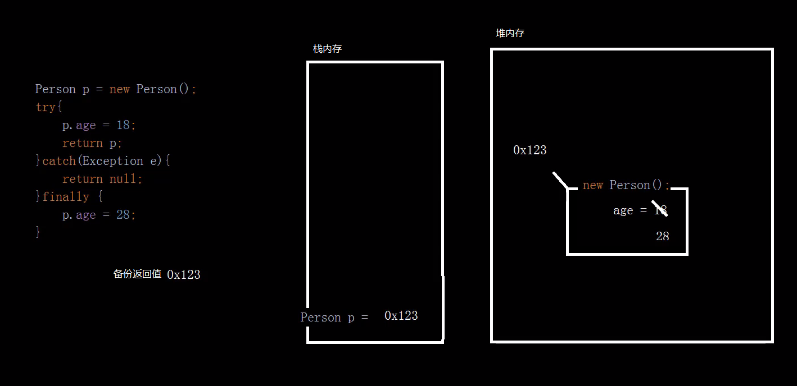
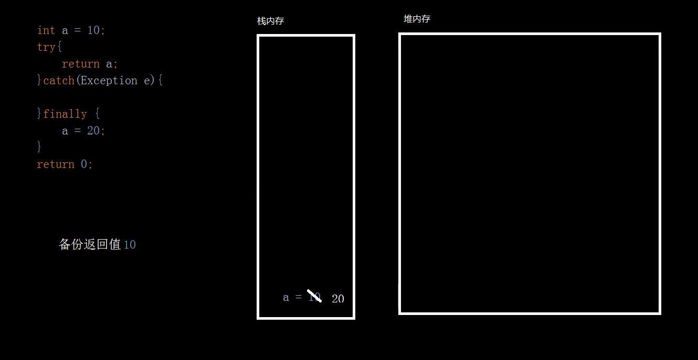

# ```finally```相关面试题

网络编程（客户端连接服务器），IO处理（文件资源释放占用文件句柄），数据库操作（占用数据库连接数的释放）等资源释放类的语句都要放在finally块中。

## 1. ```finally```在某某情况下是否会执行

只有“某某情况”是**程序被关闭**了：如电脑停电、通过其它方式关闭——**程序结束**——```finally```才不会执行。

程序结束：软件在内存中没了，如电脑停电、电脑强制关机、电脑强制重启，这种情况从根本上就没有执行任何的代码语句操作的硬件条件了；或者代码中在```finally```块之前使用```System.exit(0)```语句退出了虚拟机JVM。

### ```finally```在```try```块中有```return```的情况下是否会执行？

#### 例1 有```return```但无返回值

```java
package com.java.demoFinally;

public class FinallyAndReturn {
    public static void main(String[] args) {
        haha();
    }
    public static void haha(){
        try {
            System.out.println("1");
            System.out.println("2");
            System.out.println("3");
            System.out.println("4");
            return;
        } catch (Exception e) {

        } finally {
            System.out.println("锄禾日当午，汗滴禾下土");
        }
    }
}
```

输出：

```
1
2
3
4
锄禾日当午，汗滴禾下土
```

即：即使在```try```中有```return```，```finally```仍然执行。可以理解为方法在结束前，即进入```return```语句时，准备结束方法到方法真正结束这期间，```finally```执行了。

## 2. 在有返回值的方法中使用```try...catch...finally```，```try```块或```catch```块中声明了返回值(```return```)，```finally```块中修改了该返回值的变量的值，最终程序结果是什么？

### 例2 ```return```返回引用数据类型

```java
package com.java.demoFinally;

public class FinallyAndReturnBasicDataType {
    public static void main(String[] args) {
        Person p = haha();
        System.out.println(p.age);
    }
    public static Person haha(){
        Person person = new Person();
        try {
            person.age = 18;
            return person;
        } catch (Exception e) {
            return null;
        } finally {
            person.age = 28;
        }
    }
    static class Person{
        int age;
    }
}
```

输出：

```
28
```

流程：```haha()```方法在执行时，进入```try```块的```return person;```语句时，先准备好要返回的值，即变量```person```的值，并将**其值复制备份**，然后执行```finally```块中的内容，然后返回备份的值结束方法。最终```main```方法打印```p```中的```age```的值，最后结束程序。

注意：```return```复制备份的```person```的值，实际上是这个对象实例在堆中的内存地址的值，方法返回的备份亦是该内存地址，故```finally```在返回备份值之前调用了内存地址并修改了内存地址内的对象的属性，其修改将会生效，因后续```main```方法调用的```p```仍然调用的是先前```person```对象实例的内存地址。

### 例3 return返回基本数据类型

```java
package com.java.demoFinally;

public class FinallyAndReturnBasicDataType {
    public static void main(String[] args) {
        System.out.println(haha());
    }
    public static int haha(){
        int a = 10;
        try{
            return a;
        } catch (Exception e){
            return 0;
        } finally {
            a = 20;
        }
    }
}
```

输出：

```
10
```

流程：```haha()```方法在执行时，进入```try```块的```return a;```语句时，先准备好要返回的变量```a```的值，将**该值复制备份**，然后执行```finally```块中的内容，然后返回**备份的值**结束方法。最终```main```方法打印```a```中的值，最后结束程序。

注意：之所以```finally```中的更改未生效，原因在于```return```在执行```finally```之前复制备份的返回值，实际上就是变量```a```的当前值，即```10```，```finally```中修改了```a```的值，但不会更改```return```已经备份的```10```，故```finally```确实修改了```a```的值（```finally```确实执行了），但该新值不会再被```return```返回了。

### 画图解释 例2 与 例3 内存层面的流程：

视频：03_try_catch.mp4 [01:10:47]

#### 例2 ```return```返回引用数据类型 内存分析



#### 例3 ```return```返回基本数据类型 内存分析



## 3. 代码中阻止```finally```代码块执行的唯一可能性

使用```System.exit(0)```，该操作将直接退出虚拟机JVM，中断所有代码的执行，如：

```java
package com.java.demoFinally;

public class FinallyAndSystemExit {
    public static void main(String[] args) {
        haha();
    }
    public static void haha(){
        try {
            int a = 10;
            int b = 0;
            System.out.println(a/b);
        } catch (Exception e) {
            System.out.println("出现了异常");
            // 退出JVM
            System.exit(0);
        } finally {
            System.out.println("锄禾日当午，汗滴禾下土");
        }
    }
}
```

输出：

```
出现了异常
```

以上代码运行时，```finally```代码块不能被执行。

## 总结：面试关于```finally```的问题一般围绕两点

- ```finally```必然执行 的特性，以及 
- ```return```的时机